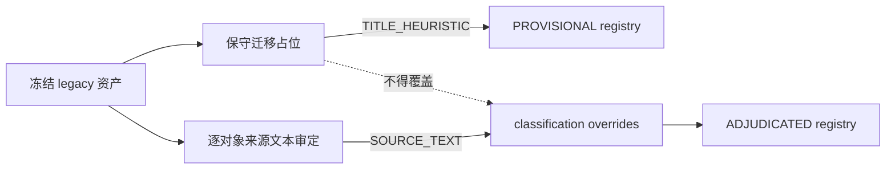
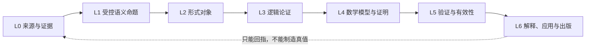
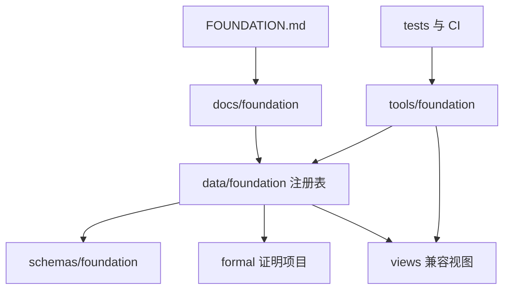
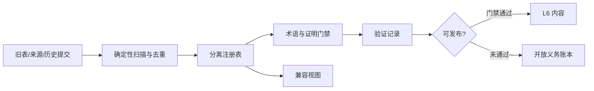
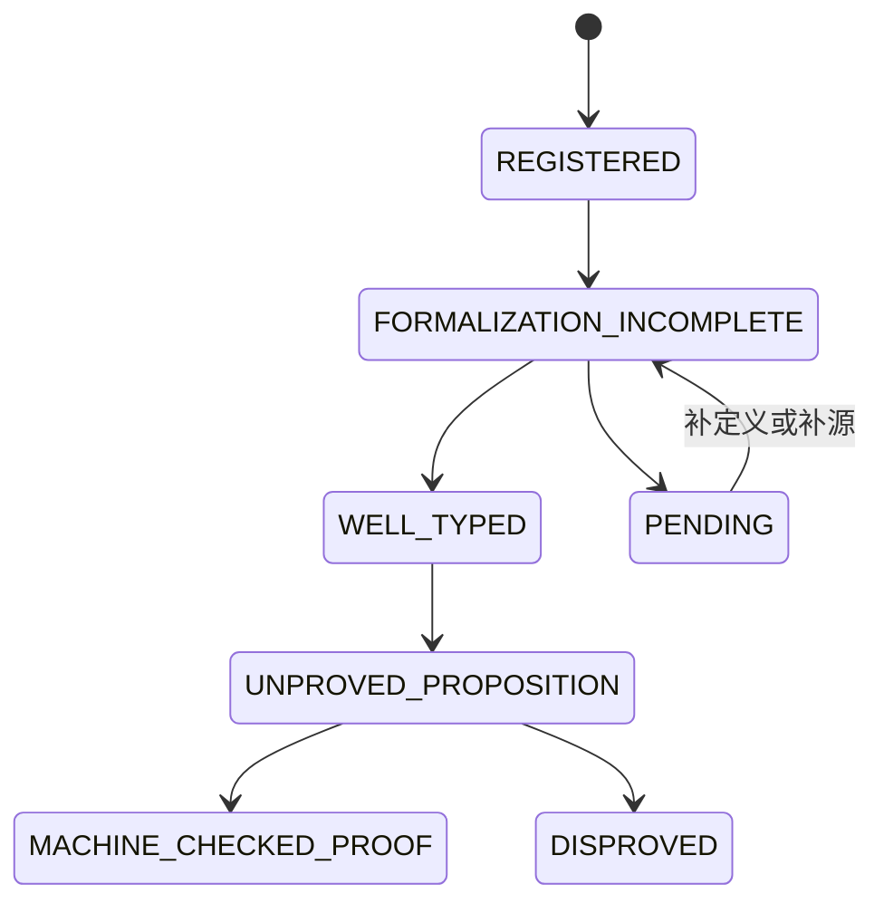
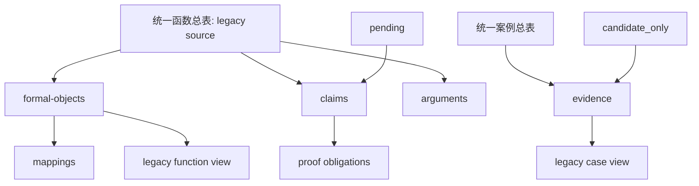

# 点火 078 正式架构（继承 076）

状态：`CORE_KERNEL_ADJUDICATED_REMAINING_CONTENT_QUEUE`。迁移覆盖为 622/622；registry 语义审定为 621/622，另有 9 个 Y1/MF-0000 内部组件记录。该状态不表示 622 个对象全部被证明。

## 迁移与审定分层

`migration_coverage=complete` 只说明 ID 与来源映射存在；`semantic_adjudication=incomplete` 说明仍有 D598 未深审。迁移器只能产生 `PROVISIONAL` 占位，已审定记录由独立 override 层保护。

## 七层关系

L0 记录来源事实；L1 声明主体、条件、量词、范围与失败边界；L2 选择正确对象类型；L3 显式保存前提、规则与结论；L4 保存模型、证明义务、证明和反例工件；L5 分开评估形式、逻辑、数学、经验、范围和来源；L6 负责阐释与发布。

## 目录权威

`data/foundation/` 是状态与映射的机器权威；`统一函数总表/`、`统一案例总表/` 是冻结的 legacy source；`views/` 是可重建兼容投影。

## 数据流

去重实体键为 `(asset_kind, normalized_namespace, normalized_id)`；表示层键为 `(entity_key, path, git_blob_sha)`。对象、命题、论证、来源、证据、映射、证明和验证不可混算。

## 状态流转

九个独立状态轴为 workflow、semantic、formal、logic、proof、evidence、scope、provenance、migration。任何一轴不得自动升级另一轴；工作流关闭不是真值，案例累积不是定理，机器证明也不自动产生经验真实性。

## 迁移图

迁移是可逆、增量、非破坏性的。回滚只需移除生成的注册表和视图；旧资产不得重编号或覆盖。

## 核心系统定性

- Ψ0/Y1 是工作流编排器，不是凭乘积符号成立的证明函数。
- J+、J- 是内部正/负证据通道，不是真值或证明 oracle。
- 十二元协议是规范、启发式或治理算子，不自动成为公理。
- 64 组合是设计/生成空间，不是理论证明空间。
- G_delta 仅可作为有适用条件的外部定理引用或受限类比。
- C(x,y) 是机制假说，不是已识别因果；I_iso 是结构对应关系，不是严格同构。
- Ψ0 中的乘号表示流程组合或联合约束，不表示普通数值乘法。

执行入口与门禁见 [FOUNDATION.md](FOUNDATION.md)。
