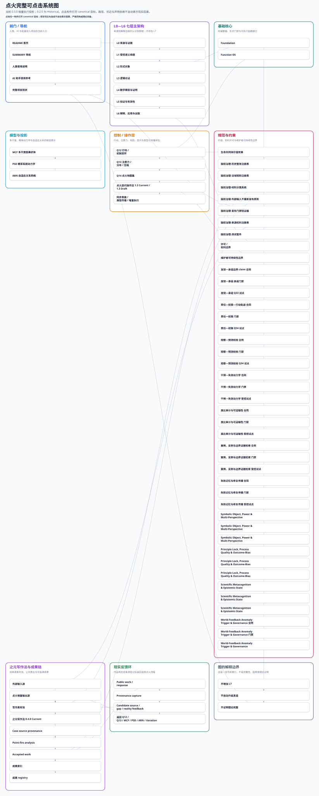

# When Systems Catch Fire / 点火

## 项目现状

点火是一个在公共仓库中持续生长的跨领域认知与行动系统。它试图解决的不是某一个学科问题，而是一个更基础的问题：当材料来自不同领域、证据强弱不一、概念彼此缠绕时，怎样把它们整理成可以追溯来源、检验推理、建立模型、指导行动并接受现实反馈的结构。

它把一项认知活动拆成相互连接但不能混同的环节：保存来源和证据，形成有边界的命题，把命题转成合适的形式对象和模型，记录论证、证明、反例与验证，再把通过边界检查的结果用于解释、执行和公开表达。项目中的基础注册表、执行系统、跨尺度因果建模、概率动力学、关系网络、迭代方法、价值宪章和写作表达，都是这条链上的不同部分，而不是彼此孤立的功能堆叠。

经过持续迭代，点火已经从早期的笔记与函数整理，生长为一套仓库原生、版本化、可执行、可审计的研究基础设施原型。它能够保存历史而不覆盖历史，让结论随新证据降级或修正，让行动结果重新进入系统，并把项目自身的变化也纳入同一套传播、验证和更新机制。它现在已经具有较完整的结构与运行骨架，但大量具体内容的深度审定、外部验证和现实应用仍在继续。

## 项目宣言

丹无定形，火有法度；

炼无终局，化有来路。

这两句是点火对自身生长方式的表达，不是项目现状说明，也不是具有约束力的价值宪章条款。它表达的是一种世界观：点火没有预设的最终形态，但它的变化必须有方法、有来源、可追溯，也必须保留自身如何变化而来的道路。

**首要入口：** [阅读版首页](https://arvin-liu.github.io/when-systems-catch-fire/) / [GitHub 仓库](https://github.com/Arvin-liu/when-systems-catch-fire) / [项目现状](./docs/project-current-state.md) / [生命共同体价值宪章](./docs/governance/life-community-value-charter.md) / [点火迭代操作法](./ITERATION.md) / [AI 助手使用参考](./docs/ai-assistant-usage-reference.md)

<!-- STAGE-SNAPSHOTS:START -->
## 正在炼化 / Recent Stage Results

> 这里展示的是可审计的阶段快照，不是能力接受公告。`PUBLISHED_SNAPSHOT != ACCEPTED`；`PUBLISHED_SNAPSHOT != CURRENT`；`PUBLISHED_SNAPSHOT != ACTIVATED`；`SNAPSHOT_MERGED_TO_MAIN != CANDIDATE_PAYLOAD_MERGED_TO_MAIN`；`HOMEPAGE_VISIBLE != CAPABILITY_AVAILABLE`。Current 正式能力仍以“项目现状”和正式 capability registry 为准。

### R5-A 两轮窄修复已验收，阶段快照已发布

**类别：** 阶段快照 / `IMPLEMENTED_PENDING_REVIEW` / `PARTIAL`

**版本：** [Arvin-liu/when-systems-catch-fire PR #134](https://github.com/Arvin-liu/when-systems-catch-fire/pull/134) @ `48f87616e01e`；分支 `agent/iteration-method-1-4-continuous-stage-snapshot-publication-r1-20260726`

**状态边界：** Accepted=`false` · Current=`false` · Activated=`false` · 正式能力影响=`false`

**最终责任主体：** `ORGANIZATION` Arvin-liu/when-systems-catch-fire project governance（`org:github/arvin-liu/when-systems-catch-fire`；Stage snapshot publication accountability and governance；[责任依据](https://github.com/Arvin-liu/when-systems-catch-fire/pull/134)；[负责人／治理入口](https://github.com/Arvin-liu/when-systems-catch-fire/issues)）

**发布责任主体：** `ORGANIZATION` Arvin-liu/when-systems-catch-fire project governance（`org:github/arvin-liu/when-systems-catch-fire`；Stage snapshot publication accountability and governance）

**技术执行记录（非最终责任）：** Agent／模型：Codex agents；自动化／工作流：GitHub Actions

**最近成果：** 11-case 窄修复已验收并合入来源分支；R5-A 阶段快照记录已合并入 Main 并经受控同步发布为 PUBLISHED_SNAPSHOT；其精确头 48f87616 经独立 exact-head 验收（与实时 PR #134 一致）。R5-A 候选整体仍非 Accepted/Current/Activated，宪章 PR #130 仍 OPEN/DRAFT。

**仍有阻断：** R5-A 已发布阶段快照的精确头 48f87616 经独立 exact-head 验收（与实时 PR #134 一致）；但 R5-A 候选（宪章 PR #130）仍 OPEN / DRAFT，其整体精确头验收仍待账号所有者独立执行；R5-A 宪章来源分支当前头 019f52cc296b7417cc91ea97077fbf85d19ad7fc 仍需整体 exact-head 验收（候选层面，非本已发布快照层面）；本快照只公开可审计摘要和证据入口，不发布或激活候选载荷；R5-A 仍为 PUBLISHED_SNAPSHOT，accepted/current/activated 仍 false（PUBLISHED_SNAPSHOT != ACCEPTED/CURRENT/ACTIVATED 不变）

**证据：** [正式 PR](https://github.com/Arvin-liu/when-systems-catch-fire/pull/134) / [1111 回执 PR #42](https://github.com/Arvin-liu/1111/pull/42) / [快照 registry](./data/operations/stage-snapshots.json) / [责任主体 registry](./data/operations/responsibility-actors.json)

**Claim ceiling：** 仅证明两个已指明窄修复在其精确接受头通过独立实例级验收并进入 PR #130 来源分支；不证明 R5-A 整体完成、生命完整性、人体安全、疗效或普遍语义能力。

阶段记录可被后继快照修订、替代或撤回；历史仍保留。Agent 只能提交 `stage snapshot request`，不能自行声称已进入 Main。

[查看制度、状态图与发布门](./docs/operations/stage-snapshot-publication.md) / [查看全部机器记录](./data/operations/stage-snapshots.json)
<!-- STAGE-SNAPSHOTS:END -->

## 之元写作法成果

[之元写作法](./docs/publication/zhiyuan-writing-method.md)是点火同源认知结构在 L6 公共语言中的可调用投影，不是外接的文风插件或写作谋生课程。`0.4.0` 是当前能力，素材池明确分为“外部输入源 + 点火增量输出源”，使 claim、argument、mechanism、map、gap、residue、分析报告、模型投影和 provenance-gated 返回项也能继续成为写作材料；`0.3.0` 保留为历史已合并版本。派生产物不是新的独立证据，调用也不等于复制之元本人或证明方法普遍有效。

### [《当一支军队开始相信自己的背影》](./docs/publication/works/when-an-army-believes-its-own-back.md)

从金辽战场中的一次后退出发，穿过声学、金融与电网，追问系统怎样把自己的反应当成现实，以及稳定最终由谁承担成本。

**成果链：** [起始案例](./docs/publication/cases/jin-rise-case-source.md) → [点火分析](./reports/publication/jin-rise-point-fire-analysis.md) → [之元写作法成稿](./docs/publication/works/when-an-army-believes-its-own-back.md) → [使用的方法](./docs/publication/zhiyuan-writing-method.md)

[查看更多之元写作法成果](./docs/publication/zhiyuan-writing-showcase.md)

## 生命共同体价值宪章

> 长瞻一宇同叩月，此心相契共今宵。

价值宪章约束点火判断什么值得做：谁受益、谁承担风险、哪些主体沉默、什么情况下必须拒绝、暂停或回滚。它跨越 L0-L6、Ψ₀、元协议和 Function OS，但它是规范边界，不是经验事实、数学证明、治理批准或项目定位。

除规范性价值宪章外，仓库现含 **Charter System R1（宪章系统 R1）** 治理系统：它把上述约束整理为可机器检查、可审计的治理构件与注册表（见 `docs/governance/charter-system-r1.md` 与 `docs/governance/charter-system-registry.json`）。其状态为 Accepted／Current，但 `activated=false`、`publication_status=UNPUBLISHED`——治理系统已就位并 Current，尚未激活任何能力、运行时或执行器，也未发布快照。

[阅读全文：生命共同体价值宪章](./docs/governance/life-community-value-charter.md) / [Charter System R1 治理系统](./docs/governance/charter-system-r1.md)

## 完整可点击系统图

这是一张单一完整图，覆盖前门、L0—L6、基础核心、模型投影、Q12—Q14、迭代与同步、价值约束、之元写作法双来源素材池、成果链和现实反馈返回。Current 0.3.0 由[构件 registry](./data/operations/project-components.json)、[传播 topology](./data/operations/change-propagation-topology.json)与[布局 overlay](./data/architecture/interactive-system-map-layout.json)确定性派生；Historical 0.2.0 保留版本轨迹，Q32I 投影不增加 L7。节点与连线是可审计导航，不证明因果、严格同构或理论完整。

[打开交互版完整图](https://arvin-liu.github.io/when-systems-catch-fire/system-map.html) / [查看维护与验证说明](./docs/architecture/interactive-system-map.md)

<div class="pages-interactive-system-map">
  <object data="./generated/ignition-system-map.svg" type="image/svg+xml" aria-label="点火完整可点击系统图">
    <p>浏览器无法嵌入交互 SVG。请<a href="https://arvin-liu.github.io/when-systems-catch-fire/system-map.html">打开交互版完整图</a>。</p>
  </object>
</div>

<p class="github-system-map-preview">
  <a href="https://arvin-liu.github.io/when-systems-catch-fire/system-map.html">
    
  </a>
</p>

GitHub README 对 SVG 内部热点的支持可能受限；上方完整预览点击后进入 Pages 交互版。Pages 首页中的图节点可直接跳转到各构件 canonical 页面。

## 使用指南

- [人类使用说明](./docs/USAGE.md)
- [AI 助手使用参考](./docs/ai-assistant-usage-reference.md)
- [点火迭代操作法](./ITERATION.md)
- [第一次阅读入口](./SUMMARY.md)

<details>
<summary>展开：完整 AI 首次阅读提示词</summary>

普通人无需先读完整仓库。你可以把下面提示词复制给自己常用的 AI，让它先帮你做第一轮阅读。

可选入口：[ChatGPT](https://chatgpt.com/) / [Claude](https://claude.ai/) / [Gemini](https://gemini.google.com/) / [Microsoft Copilot](https://copilot.microsoft.com/) / [Perplexity](https://www.perplexity.ai/) / [Grok](https://grok.com/) / [DeepSeek](https://chat.deepseek.com/) / [Kimi](https://www.kimi.com/) / [豆包](https://www.doubao.com/) / [千问](https://www.qianwen.com/qianwen/)

```text
请阅读并分析点火项目：
https://github.com/Arvin-liu/when-systems-catch-fire

我是第一次接触这个项目。请不要只根据项目名称、README 的宣传性句子
或作者愿景作结论，也不要把候选能力、测试通过或未来计划当成
已经被现实证明的结果。

请优先阅读以下文件：
README.md
docs/project-current-state.md
docs/governance/life-community-value-charter.md
ITERATION.md
ARCHITECTURE.md
docs/architecture/interactive-system-map.md
FOUNDATION.md
function-os-candidate/v0.2/README.md
docs/architecture/multiscale-causal-fabric.md
docs/architecture/probabilistic-system-dynamics.md
docs/architecture/adaptive-relational-network.md
docs/USAGE.md
AI-START-HERE.md
llms.txt

然后用普通人能理解的中文回答：

1. 当前版本的点火是一个什么样的项目？它明确不是什么？
   请把“当前现状”与“永久定位”区分开。
2. 它由哪些核心部分组成？项目现状、生命共同体价值宪章、Foundation、
   Ψ₀、Function OS、效果推理与机制判断、注意力与分布控制、
   地图集、MCF、PSD、ARN、点火迭代操作法和现实反馈分别负责什么？
   请解释 MCF、PSD 与 ARN 怎样分工、连接，以及 ARN 为什么把因果主张
   委托给 MCF。
3. 它对普通人的工作、学习、生活判断和长期项目有什么实际作用
   或方法启发？请给出至少 3 个具体场景，并区分哪些是仓库
   已实现能力，哪些只是可借鉴的方法。
4. 一个第一次使用点火的人，应从哪里开始？请给出一个不超过 7 步
   的最小使用流程。
5. Function OS 是什么？人类和 AI 应怎样使用它？它能产出什么？
   它当前的限制、风险、适用边界和不能证明的事情分别是什么？
6. 项目当前有哪些结论仍只能标记为 candidate、pending、
   需要外部验证或等待现实反馈？
   请明确区分“当前仓库能力”“候选派生表示”和“已证明的科学理论”。
   MCF、PSD 和 ARN 不是新的真值层，请不要把表示能力写成事实证明。
7. 点火怎样处理证据、反例、错误、失败、外部反馈和结论降级？
8. 点火的生命共同体价值宪章怎样约束“什么值得做”，
   而不冒充事实证据或数学证明？
9. 请把重要判断链接到仓库中的具体文件；遇到文件冲突时，
   以当前 main 的正式资产、测试、CI 和明确状态字段为准，
   不要自动选择更宏大的说法。
10. 最后请根据我的实际工作、学习或生活，向我提出最多 5 个
    真正必要的问题，然后给我一份个性化的首次使用建议。

如果你无法访问这个 GitHub 仓库，请直接说明无法读取，
不要编造项目内容。
```

[打开点火项目 GitHub 首页](https://github.com/Arvin-liu/when-systems-catch-fire)

[查看完整 AI 助手使用参考](./docs/ai-assistant-usage-reference.md)

</details>

## 项目内容入口

<details>
<summary>展开：第一次阅读与 AI 入口</summary>

- [人类导航页](./SUMMARY.md) — 给第一次阅读的人提供更完整的目录式导览。
- [使用说明](./docs/USAGE.md) — 说明怎样按七层架构处理材料、提交候选和避免误用。
- [AI 助手使用参考](./docs/ai-assistant-usage-reference.md) — 提供可直接复制给常用 AI 的完整阅读提示词。
- [点火迭代操作法](./ITERATION.md) — 说明每一轮变更怎样从远端真相、缺口、claim ceiling、同步矩阵、验证和回执中闭环。
- [AI 冷启动入口](./AI-START-HERE.md) — 告诉零背景 AI 应按什么顺序读仓库、哪些边界不能混。
- [AI 交接契约](./AI-HANDOFF.md) — 记录跨会话交接时必须重新核验的权威链和红线。
- [机器入口](./llms.txt) — 给 LLM 和自动化工具读取的简明项目边界与关键路径。
- [Get 笔记协作流程](./docs/GET-BRAIN-WORKFLOW.md) — 说明 Get 笔记材料如何进入点火协作与审查流程。
- [之元写作法](./docs/publication/zhiyuan-writing-method.md) — 当前 `0.4.0` 使用“外部输入 + 点火增量输出”双来源素材池；`0.3.0` 为历史已合并版本，增量复用不提高证据权限。
- [完整可点击系统图](./docs/architecture/interactive-system-map.md) — spec 驱动的项目总地图、节点入口、双表面行为与生成验证说明。
- [类型化变更传播闭包](./docs/architecture/typed-change-propagation.md) — 121Q32 的构件 registry、三类关系权限、fixpoint、map diff 与 residue 契约。
- [版本规范](./docs/VERSIONING.md) — 说明版本、状态、兼容路径和发布边界怎样记录。

</details>

<details>
<summary>展开：架构、Foundation 与正式资产</summary>

- [Function OS](./function-os-candidate/v0.2/README.md) — 说明它是什么、人类与 AI 怎样使用、能产出什么，以及当前限制、风险和不能证明的事情。
- [现行架构](./ARCHITECTURE.md) — 说明 L0-L6、Foundation、Function OS 和操作 overlay 的当前关系。
- [Foundation](./FOUNDATION.md) — 说明数学与逻辑双地基、注册表权威和不可越权的证明门禁。
- [Foundation 文档入口](./docs/foundation/README.md) — 汇总数学、逻辑、状态系统、注册表契约和迁移说明。
- [项目状态](./data/foundation/project-state.json) — 用机器可读方式记录当前 Foundation 计数和状态。
- [Registry manifest](./data/foundation/registry-manifest.json) — 列出 Foundation 注册表文件及其作用。
- [Migration summary](./data/foundation/migration-summary.json) — 记录 legacy 资产迁移覆盖与摘要。
- [点火地图集](./docs/architecture/ignition-atlas.md) — 说明地图集只是版本化导航投影，不是新的真值来源。
- [多尺度因果织体 MCF](./docs/architecture/multiscale-causal-fabric.md) — 说明如何组织有因果类型的跨尺度投影，以及为什么可达性和图结构不等于真实因果。
- [概率系统动力学 PSD](./docs/architecture/probabilistic-system-dynamics.md) — 为 MCF 补充明确的概率语义、状态演化和系统边界，不默认高概率就是强因果。
- [自适应关系网络](./docs/architecture/adaptive-relational-network.md) — 说明当前关系网络投影、扰动重构和嵌入证据摘要的操作边界。
- [项目架构兼容入口](./docs/PROJECT-ARCHITECTURE.md) — 保留旧读者可进入的兼容路径，但不是当前权威。
- [统一函数总表历史兼容入口](./统一函数总表/INDEX.md) — 保留旧函数表索引，用于历史追溯和兼容查看。
- [统一案例总表历史兼容入口](./统一案例总表/INDEX.md) — 保留旧案例表索引，用于历史追溯和兼容查看。

</details>

<details>
<summary>展开：证据、反例与治理</summary>

- [断言等级](./docs/claim_levels.md) — 说明历史 claim level / assertion grade，避免和架构 L0-L6 混用。
- [证据机制](./docs/evidence_regime_library.md) — 说明不同证据类型如何支持或限制结论。
- [反证模板](./docs/falsifiability/README.md) — 提供记录反例、失败条件和可证伪路径的模板。
- [失败案例库](./case_failures/README.md) — 汇总项目已记录的失败案例与修正入口。
- [元协议概览](./docs/meta-protocols/README.md) — 说明 12 元协议与组合矩阵的入口和使用边界。
- [12 元协议](./docs/meta-protocols/12-meta-protocols.md) — 展示当前元协议文本，但它们不是自动成立的数学公理。
- [生命共同体价值宪章](./docs/governance/life-community-value-charter.md) — 说明项目最高规范边界怎样约束行动价值。
- [外部治理记录](./docs/governance/meta-protocol-reviews/12-meta-protocol-normative-review.md) — 记录 12 元协议的规范性审核，不等于事实证明或治理批准。

</details>

<details>
<summary>展开：参与、可持续性、许可与历史资产</summary>

- [参与说明](./docs/participate.md) — 说明如何提交独立审查、非商业使用记录或支持/商业许可询问。
- [SUPPORT](./SUPPORT.md) — 说明维护者可持续性、支持边界和反赞助俘获规则。
- [商业许可](./COMMERCIAL-LICENSING.md) — 说明商业生产使用、互惠协议和当前许可边界。
- [可持续性政策](./SUSTAINABILITY.md) — 说明 AI 额度、CI、设备、时间和基本生活支持为什么属于项目基础成本。
- [许可作用域](./LICENSES/README.md) — 说明 BUSL、AGPL 转换、CC、Apache 与历史 MIT 权利的分层关系。
- [根 LICENSE](./LICENSE) — 记录当前分发版本的根许可说明。
- [贡献指南](./CONTRIBUTING.md) — 说明贡献前的许可门禁、案例/函数提交方式和行为边界。
- [现实反馈参与入口](./docs/participate.md) — 说明外部反馈如何进入“缺口发现 -> 结构修正 -> 再验证”链条。

</details>
