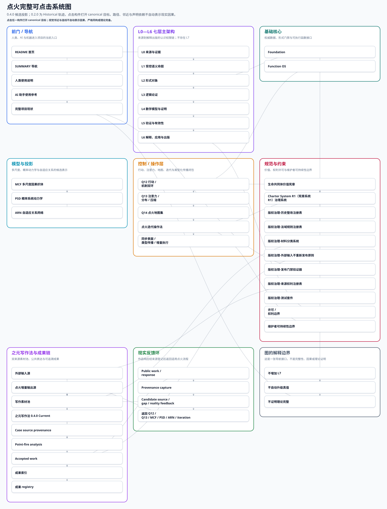

# When Systems Catch Fire / 点火

> 丹无定形，火有法度；炼无终局，化有来路。

点火是一个仓库原生、版本化、可审计的跨领域研究与行动基础设施原型。它保存来源，把命题与证据、模型、证明、反例、验证和现实反馈分开记录，并允许结论在新证据出现后被修订、降级、隔离或撤回。

它是候选生成、结构发现、模型组织与可审计推理系统，不是自动产生外部真理的机器。编号、公式、AI 输出、内部自洽、测试通过或登记闭合，都不能单独证明自然、社会、生命、意识或 AI 的事实。

**从这里开始：** [统一知识入口](./KNOWLEDGE/README.md) · [最新变化](./KNOWLEDGE/WHATS-NEW.md) · [知识地图](./KNOWLEDGE/MAP.md) · [搜索与交叉引用](./KNOWLEDGE/SEARCH.md) · [当前结果](./RESULTS/LATEST.md) · [纠正与撤回](./RESULTS/CORRECTIONS.md) · [开放问题](./RESULTS/OPEN-QUESTIONS.md) · [项目现状](./docs/project-current-state.md)

## 当前结论

- 点火已经形成 Foundation、Function OS 候选、跨尺度因果织体 MCF、概率系统动力学 PSD、自适应关系网络 ARN、迭代与同步系统、价值宪章和写作表达等仓库构件。它们提供的是表示、审计与执行边界，不是一个已完成并被外部验证的普适理论。
- 数学成熟度 `M0—M6` 与外部证据成熟度 `E0—E5` 是两条独立轴。数学形式更完整不等于现实证据更强；经验材料增多也不自动完成数学证明。
- 任务 102 纳入新语料并排除生成投影回灌后，历史函数资产注册表登记了 **5,663** 个 canonical identity card；其中 **3,887** 个仍处于显式 quarantine 或 pending。登记闭合只表示每个发现项有去处，不表示全部定义、证明或实证义务已经完成。
- 同次重算的全语料非函数断言注册表登记了 **17,333** 个 canonical claim；其中 **5,581** 个处于显式 quarantine 或 pending，公开表面违规为 **0**。这些计数会随受治理语料变化，是仓库审计结果，不是对断言真实性的统计证明。
- 当前门控乘积模型没有完成四种基本相互作用统一；四力统一、量子引力和物理学大一统仍是开放研究问题。点火未证明“大一统普遍不可能”。
- 生命共同体价值宪章约束“什么值得做、何时应暂停或回滚”，但价值判断不替代事实证据、数学证明或治理授权。

[查看带来源和边界的当前结果](./RESULTS/LATEST.md) · [证据程序与首个可证伪验证试点](./evidence-program/README.md)

## 已完成的纠正

- 撤回把单一门控乘积模型失败推广成“所有大一统理论不可能”的越界结论。
- 区分历史笔记中的“乘法归零律”与正式资产身份：正式仓库的该资产是 `T2`；`D127` 是另一项“认知路径积分函数”。
- 区分历史物理笔记对 `D260` 的使用与正式资产：正式 `D260` 是 `p/(1-p)` 偏差敏感度评分，不是大一统不可能命题。
- 阻断“类比即同构”“图可达性即现实因果”“内部测试通过即外部真理”“一个模型失败即普遍不可能”等回弹路径。
- GitHub Pages 阅读页已退出维护面；其中的系统图迁移为普通 Markdown 可达的仓库文件。当前公开阅读权威是 GitHub 仓库中的 README、`HUMAN-READING.md` 与 `RESULTS/`，不再依赖独立部署页。

[查看逐项纠正、旧说法、当前说法与依据](./RESULTS/CORRECTIONS.md)

## 仍然开放的问题

- 如何在不把候选表示误作事实的前提下，为跨尺度、跨领域映射补齐对象、映射、结构保持条件与反例？
- 5,663 个函数资产中大量未定义或仅算法性条目，哪些值得进入人工定义、证明或实验队列？
- 17,333 个非函数断言中哪些应优先补证，哪些应长期保持历史记录或隔离？
- MCF、PSD、ARN 和 Function OS 候选怎样通过独立数据、基线、失败条件与复现获得外部证据？
- 四力统一、量子引力、暗物质、暗能量、宇宙常数与测量问题等物理问题，点火模型目前只能提供哪些有界投影，哪些桥接义务尚未满足？
- 如何让每次机器资产变化都同步生成人能读懂、带结论边界的结果，而不把自动摘要升级成新知识？

[查看开放问题、所需证据与停止条件](./RESULTS/OPEN-QUESTIONS.md)

## 研究、复算与文章结果

仓库中的文章运行、外部研究、复算、审计和迭代报告不再只埋在目录或旧表中。`RESULTS/` 提供按主题和时间组织的人类入口，并保留每项结果的原始来源、问题、方法或证据类别、结论、成熟度、变化、局限与最终处置。

目前可直接阅读的主线包括：

- [物理资产纠偏与复算边界](./docs/foundation/physics-asset-correction-20260729.md)
- [函数资产历史普查与深度裁决](./docs/foundation/historical-function-deep-adjudication-20260729.md)
- [非函数断言与证据谱系闭合](./reports/foundation-architecture/100-nonfunction-claim-evidence-lineage-closure.md)
- [外部研究报告集合](./reports/external-research/)
- [之元写作法与成稿成果](./docs/publication/zhiyuan-writing-showcase.md)
- [全部历史结果台账](./RESULTS/CHRONOLOGY.md)

[按研究与文章阅读](./RESULTS/RESEARCH-AND-ARTICLES.md)

## 函数与断言裁决结果

两张历史总表继续保留作来源和兼容入口，但不再承担“当前结论总览”的角色。当前阅读入口是 [裁决总结](./RESULTS/ADJUDICATION-SUMMARY.md)，它解释计数、主要身份、处置、成熟度、典型例子和具体资产入口；完整机器表仍保存在：

- [函数资产 closure summary](./data/foundation/function-assets/closure-summary.json)：函数身份卡、定义/类型/量纲、义务、依赖、处置和 quarantine 的当前计数入口；完整目录为 `data/foundation/function-assets/`。
- [非函数断言 closure summary](./data/foundation/nonfunction-claims/closure-summary.json)：定理、规律、机制、因果、不可能性、跨域对应、预测、经验与解释性断言的当前计数入口；完整目录为 `data/foundation/nonfunction-claims/`。
- [统一函数总表历史入口](./统一函数总表/INDEX.md) 与 [统一案例总表历史入口](./统一案例总表/INDEX.md)：只用于历史追溯，不是现行裁决权威。

## 持续自我纠错

新增或修改知识资产必须同时生成机器记录和人类可读结果。当前治理链会产生：

1. `Claim Delta`：发现新增、删除或修改的知识资产及其关联断言；
2. `Impact Analysis`：沿断言与函数依赖关系计算受影响范围；
3. `Evidence Lineage Delta`：保留来源、证据状态与支持范围；
4. 自动审计：证明义务、实证义务、跨域映射、量词膨胀、循环论证、类比冒充同构、模型失败推出普遍不可能、撤回结论回弹；
5. 人类可见性门禁：检查机器结果的人类对应物、两步可达导航、过期状态、默认隐藏的重要内容和断链；
6. 整改计划与追加式历史：保留撤回、降级、隔离和修订，不删除历史证据，不改写 Git 历史。

[自我纠错引擎说明](./docs/governance/self-correction-engine.md) · [本轮 Claim Delta](./RESULTS/CLAIM-DELTA.md) · [影响分析](./RESULTS/IMPACT-ANALYSIS.md) · [证据链变化](./RESULTS/EVIDENCE-LINEAGE.md)

## 系统图

系统图由构件 registry、类型化传播 topology 与布局 overlay 确定性生成。节点用于导航，边只表示声明过的仓库依赖、同步义务或有边界的实质候选关系；它不证明现实因果、严格同构或理论完整性。

[打开仓库内完整 SVG](./docs/generated/ignition-system-map.svg) · [查看维护说明](./docs/architecture/interactive-system-map.md) · [查看机器 spec](./data/architecture/interactive-system-map.json)

## 任务 104 与 105：编辑叙事层与 Function OS 有界基准

任务 104（PR #160，已合并）建立了编辑文章层与语料关系分析；任务 105（PR #161，已合并，精确 head `9d7d5ab512ffe3fd109a60ebd3d9d246b3a42d19`，普通合并 `9b5b4b9bfb243fe4cc52f7b163a9613ee6628321`）执行了 Function OS v0.2 核心能力基准、对抗验证与传播。

- 任务 104 编辑叙事层：`docs/editorial/articles/`（六篇文章）+ 语料关系图，本身对首页系统图为 **NO_MAP_IMPACT**。
- 任务 105 Function OS v0.2 基准：**原始目标**判定 `PARTIALLY_SUPPORTED_WITH_IDENTIFIED_FAILURES`（25 个 false_reject，源自 N2 嵌套相等提取缺陷）；**修复后目标**判定 `SUPPORTED_WITHIN_BOUNDED_DOMAIN`（有界修复 `split('==')`→`split('==',1)`）。
- 证据上限：有界域内可信；**不声称**完整沙箱化、生产就绪或普遍正确。
- 原始目标仍标记为部分支持；只有修复后的精确 head 获得有利的有界判定，二者保持区分，不合并为单一讨好结论。

[任务 105 文章：边界之内的可信](./docs/editorial/articles/007-bounded-trust-function-os-v02-capability-benchmark.md) · [当前结果](./RESULTS/LATEST.md)

## 项目内容入口

### 第一次阅读与使用

- [统一知识入口](./KNOWLEDGE/README.md)：不需要知道文件路径或资产编号
- [最新变化](./KNOWLEDGE/WHATS-NEW.md) · [知识地图](./KNOWLEDGE/MAP.md) · [搜索](./KNOWLEDGE/SEARCH.md) · [分层阅读](./KNOWLEDGE/READING-LAYERS.md)
- [十分钟人类阅读路线](./HUMAN-READING.md)
- [项目现状](./docs/project-current-state.md)
- [点火迭代操作法](./ITERATION.md)
- [使用说明](./docs/USAGE.md)
- [AI 助手使用参考](./docs/ai-assistant-usage-reference.md)
- [AI 冷启动入口](./AI-START-HERE.md)
- [AI 交接契约](./AI-HANDOFF.md)
- [机器入口](./llms.txt)

### 架构、Foundation 与正式资产

- [现行架构](./ARCHITECTURE.md)
- [Foundation](./FOUNDATION.md)
- [Foundation 文档入口](./docs/foundation/README.md)
- [Function OS 候选](./function-os-candidate/v0.2/README.md)
- [断言治理与函数身份](./docs/foundation/claim-governance-and-function-identity.md)
- [历史函数资产深度裁决](./docs/foundation/historical-function-deep-adjudication-20260729.md)
- [非函数断言裁决](./docs/foundation/nonfunction-claim-adjudication-index.md)
- [未来断言准入协议](./docs/foundation/future-claim-admission-protocol.md)
- [MCF](./docs/architecture/multiscale-causal-fabric.md) · [PSD](./docs/architecture/probabilistic-system-dynamics.md) · [ARN](./docs/architecture/adaptive-relational-network.md)

### 证据、反例与治理

- [断言等级](./docs/claim_levels.md)
- [证据机制](./docs/evidence_regime_library.md)
- [反证模板](./docs/falsifiability/README.md)
- [失败案例库](./case_failures/README.md)
- [生命共同体价值宪章](./docs/governance/life-community-value-charter.md)
- [Charter System R1](./docs/governance/charter-system-r1.md)

### 参与、许可与历史

- [参与说明](./docs/participate.md)
- [贡献指南](./CONTRIBUTING.md)
- [支持与可持续性](./SUPPORT.md) · [可持续性政策](./SUSTAINABILITY.md)
- [商业许可](./COMMERCIAL-LICENSING.md) · [许可作用域](./LICENSES/README.md) · [根 LICENSE](./LICENSE)
- [版本历史](./CHANGELOG.md)

重要项目内容不使用默认折叠容器隐藏；README 两次点击以内可以到达当前结果、最新变化、主题地图、资产卡、分层阅读、搜索、演化/撤回、覆盖审计、纠正、开放问题、裁决总结、研究文章和机器证据入口。
