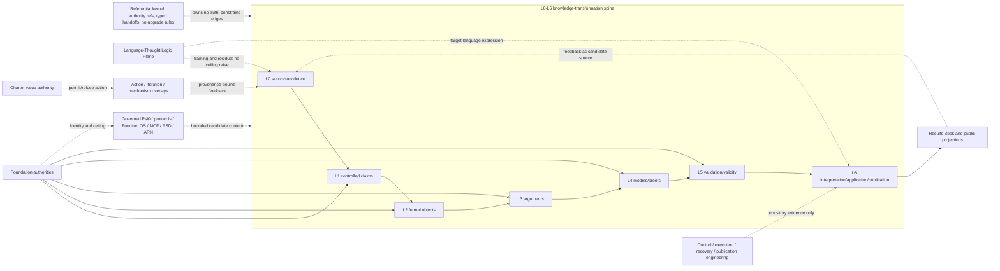
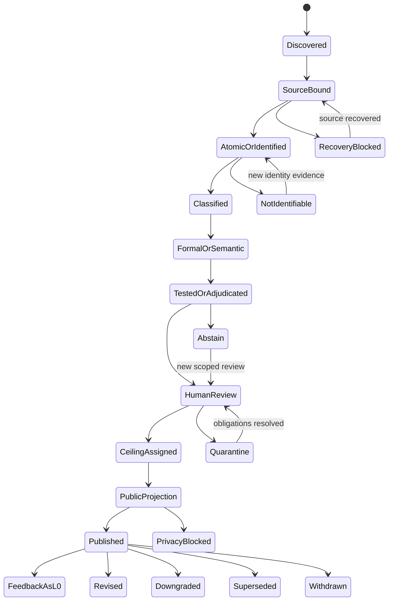
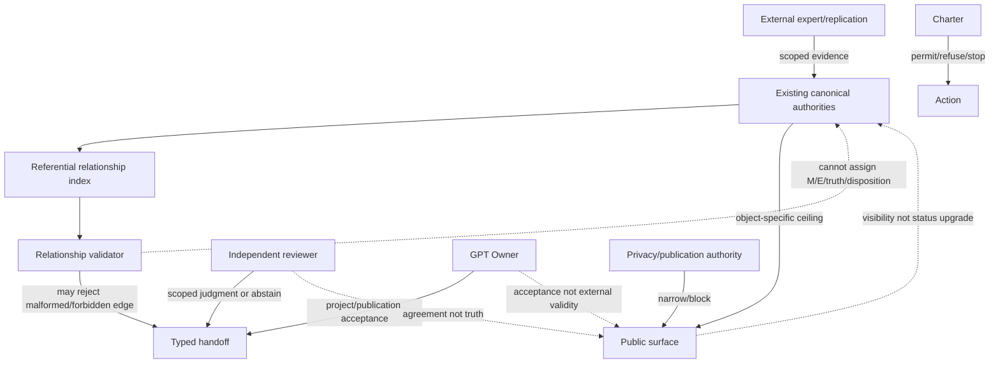
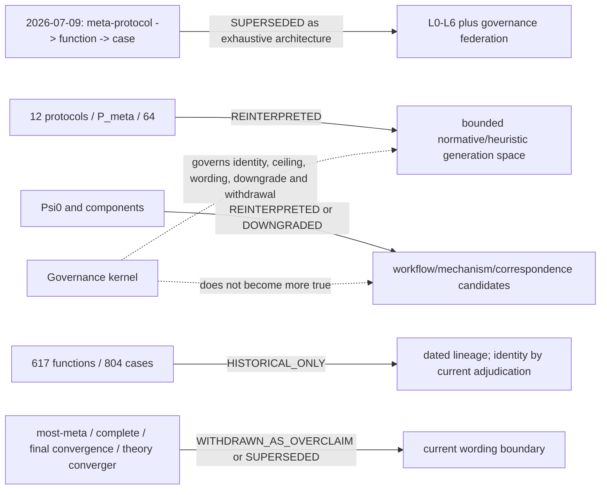

# Epistemic Governance Kernel and Federated Planes

Status: `OWNER_ACCEPTED_WITH_EXPLICIT_RESIDUALS`
Architecture disposition: `FEDERATED_ARCHITECTURE_ONLY`  
Alias: **Knowledge Qualification Federation**

当前项目/架构状态为 `OWNER_ACCEPTED_WITH_EXPLICIT_RESIDUALS`。这里的 Owner acceptance 只表示项目、架构边界与正式公开发布资格已获接受；它不是外部真理、`FORMAL_KNOWLEDGE`、同行评审、普适有效性或任何 claim-level `EPISTEMICALLY_ACCEPTED`。

## 一句话定义

**Epistemic Governance Kernel and Federated Planes**（认识论治理内核与联邦平面）是一组只记录共享禁升规则和类型化交接的引用内核；它约束点火中各自独立负责的认识论、语言、价值、行动、工程和出版平面，但不取代它们的局部状态与真值权威。

这不是一个今天新发明的“元元协议”。它是对仓库中已经反复运行的接口第一次做整体识别和显式绑定。独立反统一审查裁定：当前证据支持阶段性成熟的 federation，不足以证明一个共享状态机或单一生命周期意义上的统一架构。

## 它管什么，不管什么

它管理：对象如何回到 canonical authority，跨系统关系允许推出什么、禁止推出什么，公开措辞如何受来源与 claim ceiling 约束，以及降级、替代和撤回怎样向下游传播。

它不管理或不能证明：

- 一条命题是否为真；
- Foundation 局部记录中的 M/E、proof、evidence、disposition 或 ceiling 值；
- 什么行动在价值上值得做；
- 外部世界已经验证某个模型、元协议或整个点火；
- 一个 reviewer、Owner、CI、Git commit 或公开页面能够制造真值；
- 12 元协议、64 组合、L0–L6 或本架构已经完备、最终收敛或普遍适用。

## 为什么现在才被命名

Foundation、L0–L6、函数身份、未来断言准入、M/E 双轴、claim ceiling、J+/J−、反例、provenance、dependency、supersession/withdrawal、语言—思维逻辑平面、Charter、行动 overlay、GetNote claim pipeline 和《点火成果册》在不同任务中先后形成。它们已经共享一批稳定接口，但此前没有一个 publication-safe 的总关系索引把以下事实同时表达出来：

1. 状态与 authority 必须按对象和问题命名；
2. 跨轴不能自动升级；
3. 公开措辞不能超过局部 ceiling；
4. 新证据可以触发重审、降级、替代或撤回；
5. 历史与失败必须追加保存；
6. 关系图、成果册和机器 validator 都不能成为第二真值库。

因此，“阶段性成熟”只描述点火仓库内部已经运行的治理接口和 fail-closed 行为；显式架构当前为 `OWNER_ACCEPTED_WITH_EXPLICIT_RESIDUALS`，外部有效性仍为 `NOT_ESTABLISHED`。

## Governed-object taxonomy

| 对象类 | 例子 | 局部权威 | 内核只做什么 |
|---|---|---|---|
| 来源 | source、fragment、observation、feedback | Foundation sources/evidence、语料 intake | 绑定 provenance、privacy、source-family 约束 |
| 语义内容 | atomic claim、受控命题 | Foundation claims / nonfunction claims | 引用 identity、gate、ceiling route |
| 形式内容 | formal object、函数类资产、argument、proof | Foundation formal/function/argument/proof registries | 保持 type、proof、M/E 分离 |
| 模型与能力 | mechanism、Function OS、MCF、PSD、ARN | 模型局部契约 + Foundation claim authority | 区分可运行能力、表示状态和外部真值 |
| 历史内容 | 12 元协议、`Psi0`、旧函数/案例 | Git lineage、历史映射、现行门禁 | 保留原话，绑定现行 disposition，禁止改名回弹 |
| 资格工件 | evidence、validation、counterexample、adjudication、review | 对象局部 registry 与 scoped reviewer | 给关系和审查权限定类型 |
| 公开投影 | result unit、public statement、知识/系统图投影 | Results Book、RESULTS/KNOWLEDGE、系统图输入 | 要求 provenance/ceiling 路由，禁止反向升级 |
| 行动边界 | action candidate、workflow、execution/recovery receipt | Charter、action/mechanism overlay、iteration machinery | 路由许可与反馈；不进入 truth 状态 |

## 必须分开的 taxonomy

### Axes

Axes 是由局部权威独立维护的坐标，包括九轴状态、数学成熟度 `M0–M7`、外部证据成熟度 `E0–E7`、source lineage、claim ceiling、隐私/出版资格、语言 framing residue、能力可用性与模型主张状态、Owner/人类决定状态。

机制 overlay 的 `M0/M1` 是行动前/后的 review phase，必须写成 `mechanism_phase.M0/M1`，不得与 `mathematical_maturity.M0/M1` 比较。

### Gates

Gate 回答某个转换或公开动作是否被允许。它包括来源/隐私、atomicity/definition/scope、type/proof/circularity/isomorphism、counterexample/replication/evidence、dependency/anti-rebound、claim-ceiling/public-surface、human review、Charter permission 和 publication sanitization 等门禁。

一个 gate 通过不能静默提升另一个 axis。

### Authorities

- machine validator：验证语法、引用、确定性计算和禁止边；不能裁定语义真值；
- object-local registry：拥有其声明责任内的 identity、axis、ceiling、disposition 与 lineage；
- independent reviewer：只裁定命名的 review question，并可 `ABSTAIN`；
- Charter/human authority：允许、拒绝、停止或回滚行动；不裁定事实；
- GPT Owner：可接受项目/出版状态；不能替代 proof、evidence、replication 或外部专家；
- external expert / independent replication：增加有范围的外部证据；不自动解决价值或无关轴；
- Results Book：唯一 canonical 人类成果综合；不是第二 Foundation 或来源库。

若两个决定不可比较，合法结果是 fail-closed，不是虚构一个总 precedence。

### Dispositions 与合法悬置

`KEEP`、`REWRITE`、`DOWNGRADE`、`QUARANTINE`、`WITHDRAW`、`REJECT`、`HISTORICAL` 等 disposition 保持对象局部含义。内核只索引，不宣称它们可互换。

| 状态 | 回答的问题 | 合法含义 |
|---|---|---|
| `ABSTAIN` | reviewer 能否裁定？ | 不强迫正/负结论，等待新证据或不同 scope |
| `NOT_ASSIGNED` | 本轮是否赋值？ | 未赋值，不等于否定或未知真值 |
| `NOT_IDENTIFIABLE` | identity 能否建立？ | 身份义务未满足，等待可识别材料 |
| `REQUIRES_HUMAN_REVIEW` | automation 能否闭合语义？ | 机器必须停止 |
| `QUARANTINE` | 能否普通传播？ | 保留对象但阻止升级和公开回弹 |
| `BODY_RECOVERY_BLOCKED` | 必需 source body 是否恢复？ | 来源依赖处理暂停 |
| `PENDING` | 命名义务是否完成？ | 流程/决定尚未闭合 |
| `WITHDRAWN` | 当前许可是否仍存在？ | 移除当前许可，保留历史与原因 |

这些状态不是同一个“失败”枚举。unknown、missing、not applicable、rejected、superseded 和 historical-only 也不能互换。

## 共享 kernel invariants

1. formalization 不等于 confirmation；workflow 完成不等于 truth。
2. proof 不自动提升 E；evidence 不修复 ill-typed object。
3. 一轴不能自动升级另一轴。
4. 重复或派生来源不能按数量变成 independent source family。
5. public wording 不得高于 object-local ceiling；下游只能更窄，不能更宽。
6. dependency 继承 review/downgrade pressure 与适用 ceiling，不继承 external truth。
7. language、action success、CI、Git exactness、publication、reviewer agreement 和 Owner acceptance 不制造外部有效性。
8. missing、unknown、blocked、abstained、inapplicable、rejected、withdrawn 保持可区分。
9. supersession/withdrawal 追加保存，历史原话与失败 review 不删除。
10. relationship index 与 projection 不复制、不覆盖局部 truth authority。
11. feedback 只能作为 provenance-bound L0 candidate material 回流。
12. relation 必须声明 namespace、domain、codomain、authority 与 prohibited inference。

### K13_ASSERTION_NON-ESCALATION / ASSERTION_INFLATION_GUARD

点火允许知识增长，但禁止“断言地位”因为项目规模、叙事力量、工程成熟度、重复引用、跨域对应、模型美感、写作完成度或 Agent 共识而自动膨胀。`claim` 的 scope、evidence、proof、logic、M/E、provenance、disposition 和 public ceiling 只能由其真实记录及相应的 canonical authority 改变；最新叙事不是状态迁移器。

这是既有 Claim Ceiling、九状态轴独立、M/E 正交、回弹阻断和 provenance-gated adjudication 的仓库级组合不变量，不是新的真值层或第二套 claim registry。它在研究、裁决、写作、出版和系统总结中持续生效：

1. workflow 完成不能推出 semantic、formal、logic、proof 或 evidence 完成。
2. 工程基础设施成熟不能提升具体命题的科学地位。
3. 写作、总结、成果册、系统图和 AI 画像不得反向成为原命题的新证据。
4. 同一断言被更多文档重复引用，不增加其证据等级或独立 source family。
5. 跨域对应、结构相似和模型投影默认只产生启发或待检验假设；解释力不能自动升级。
6. M 轴和 E 轴独立推进；任何一轴不能冒充另一轴。
7. claim ceiling 由 scope、evidence、proof、logic 等真实记录的最窄适用上限决定，而不是由最新叙事决定。
8. 被撤回、降级或 quarantine 的结论不得通过改名、换表述或写入上层综合文档回弹。
9. 新证据可以触发升级，但升级必须留下可审计的 provenance、adjudication 和 validation 记录。
10. 证据不足时，默认保持、降级、开放问题化或显式声明 uncertainty；不得为了完整叙事补足结论。

机器侧只检查可确定的状态越界：既有 negative-permission profiles、typed relations、claim-governance validator、non-function closure/rebound validator、public-route ceiling 和本页 K13 obligation 必须保持封闭；它们不以字符串匹配自动判断自然语言真理。语义等价、source-family 独立性和外部有效性仍需相应的人工/独立证据裁决。

## 生命周期：对象 automata 的组合，不是一条总传送带

内容对象的常见 partial order 是：

`DISCOVER/OBSERVE → SOURCE-BIND → ATOMIZE/IDENTIFY → CLASSIFY → [FORMALIZE] → [ARGUE/MODEL] → [TEST/COUNTEREXAMPLE] → EVIDENCE-ADJUDICATE → ASSIGN-CEILING → REVIEW → SANITIZE/PROJECT → PUBLISH → FEEDBACK-AS-L0 → REVISE/DOWNGRADE/SUPERSEDE/WITHDRAW`

方括号步骤按对象可选。来源、行动、公开投影、历史记录和执行 receipt 使用不同 automata。合法 shortcut 包括：来源不产生 claim；semantic claim 不形式化；proof 保持 E0；negative/null result 在没有 positive acceptance 时公开；privacy 阻断 epistemically-permitted wording；Charter 独立拒绝行动。

### Dependency、降级与撤回

- dependency edge 必须 namespaced；
- 上游降级触发下游重审，不自动传播 truth；
- 下游 public ceiling 只能取适用约束中的更窄者；无法比较时写 `UNMAPPED/INCOMPARABLE` 并 fail closed；
- withdrawal 保留对象、旧措辞、证据与理由；
- supersession 追加 successor edge，并更新 projection 而不删除前身；
- 被撤回结论不能以“结构性”“元”“深层”等改名回弹。

## 总架构图

## Lifecycle 图

## Authority 图

## 旧架构到当前架构映射图

## 旧 2026-07-09 架构的当前状态

| 历史对象/说法 | 当前裁决 | 允许的当前措辞 |
|---|---|---|
| 元协议→函数→案例三层 | `SUPERSEDED` | 历史上有生产力的生成/索引结构，不是现行完整知识架构 |
| 12 元协议 | `REINTERPRETED` / 部分 `DOWNGRADED` | 有边界的规范、启发式、结构/演化候选词汇 |
| `P_meta` / 64 | `REINTERPRETED` | 有限 design/generation grid，不是 theory-proof space |
| `Psi0` | `REINTERPRETED` | workflow orchestrator；乘号是流程组合/联合约束 |
| `C` / `M` / `I_iso` / `L_meta` / `G_delta` | `DOWNGRADED` 或 `REINTERPRETED` | 机制、流程、对应、review routing、受条件外部定理/类比候选 |
| 十二律 / 元同构律 | `DOWNGRADED` | 可复用形式与待证明 correspondence |
| 617 函数 / 804 案例 | `HISTORICAL_ONLY` | 2026-07-09 旧 schema 的 dated census，不是现行 canonical 数量 |
| 旧 axiom/theorem/function 命名 | `SUPERSEDED` | 名称保留为 provenance，当前 identity 由 adjudication 决定 |
| “最元层” | `SUPERSEDED` | 只描述旧 generation hierarchy 内部位置 |
| “完备”“最终收敛”“理论收敛器” | `WITHDRAWN_AS_OVERCLAIM` | 只作为历史原话保留 |
| “理论生成器” | `DOWNGRADED` | candidate-generation aid，不生成 proof/truth |

旧记录不被静默改写或删除。完整 row-level 私有 provenance 不属于本公开候选；本表是 publication-safe 的状态综合。

## GetNote 1329 条意味着什么

完整的 publication-safe object-automata 映射见 [GetNote 1329 internal pressure test](getnote-1329-epistemic-governance-pressure-test.md)，机器引用映射见 [`data/governance/getnote-1329-epistemic-governance-pressure-test.json`](../../data/governance/getnote-1329-epistemic-governance-pressure-test.json)。

GetNote 管线对 source recovery、atomization、ceiling、ABSTAIN、blocked、conflict、lineage 和 publication boundary 做了大规模内部压力测试。公开口径保留 1329 claim rows、931 `EVIDENTIALLY_SUPPORTED`、307 `SEMANTICALLY_INTERPRETED`、3 `STRUCTURALLY_VALID`、88 `NOT_ASSIGNED`、38 `ABSTAIN`、50 未完成 terminal adjudication、6 个 body-recovery-blocked notes，以及 `EPISTEMICALLY_ACCEPTED=0`。

这些数字不能解释为 1329 个真知识。`EVIDENTIALLY_SUPPORTED` 只表示受控来源/材料层支持；同源重复不成为独立 source family。`EPISTEMICALLY_ACCEPTED=0` 可能说明 fail-closed 架构没有被产量压力迫使伪造接受，但它不证明系统的外部正确性或普适性。

## 与 L0–L6、Language–Thought、Charter 和 overlay 的关系

- L0–L6 是知识转换 spine；kernel 横穿它，不增加 L7。
- Language–Thought 是 peer orthogonal plane；双方共享 provenance/framing handoff，权限不同。
- Charter 是 normative/action authority；价值准入不变成事实真值。
- action/iteration/mechanism overlay 产生有边界行动与 observation；反馈回到 L0。
- control/execution/recovery 是工程实现；evidence/publication face 参与 routing，但工程成功不能提升 E。
- Foundation 是其 registry 职责内的对象/状态 authority；kernel 只引用。
- `Psi0`、元协议、Function OS、MCF、PSD、ARN 是被治理对象或局部 capability，不是总 truth authority。

## Machine binding

机器关系索引位于 [`data/governance/epistemic-governance-relationships.json`](../../data/governance/epistemic-governance-relationships.json)，对应 [JSON Schema](../../schemas/governance/epistemic-governance-relationships.schema.json)、[validator](../../tools/validate_epistemic_governance_relationships.py) 与 [tests](../../tests/test_epistemic_governance_relationships.py)。

它只保存 authority/path references、封闭的 typed effects、negative-permission profiles、条件化 federation、悬置非等价/re-entry contracts、doc-to-spec obligation inventory 与 canonical public-route inventory；不复制 claim rows 或局部状态。Charter 只参与 action-linked statement 的 permission，privacy/publication eligibility 由独立 authority 负责。

obligation inventory 将每项承诺明确标为 `MACHINE_ENFORCED`、`HUMAN_REVIEW_ONLY` 或 `UNBOUND`。前者只表示 schema、引用、封闭 effect、路由和禁止边可执行；后两者不得计入 machine maturity。source-family independence 与 external validity 仍须人审，跨局部 ceiling vocabulary 的 universal order 仍为 `UNBOUND`。validator PASS 只证明这些 repository-local bindings 一致，不证明内容真值、语义等价、架构 unity 或 external validity。

## Falsification criteria

本 kernel/federation claim 在以下任一条件成立时必须拆分、降级或撤回：

1. 某个被声明治理的 public surface 能绕过 source/authority/ceiling route；
2. 同一 decision domain 的 authority 冲突没有 precedence 或 fail-closed rule；
3. handoff 依赖静默 enum 等价；
4. relationship spec 复制或覆盖局部 truth/status；
5. workflow/proof/language/action/publication/review/Owner success 被允许升级无关 M/E/truth/ceiling；
6. governed-object classes 没有局部 automata 或 typed handoff；
7. 当前架构主张不受自身 counterexample、downgrade、withdrawal 约束；
8. 去掉局部 authorities 后，剩余 kernel 没有可执行 invariant。

外部跨域 replay 缺失会否定任何普适性主张，但不否定“当前点火仓库内部运行着这套 federation”这一更窄观察。

## 四维成熟度

| 维度 | R1 判断 | 边界 |
|---|---|---|
| operational | `PHASE_MATURE_INTERNAL` | 多个 authority、gate、lineage、悬置和 correction 已运行；不是外部真值 |
| conceptual | `FEDERATED_MODEL_SUPPORTED` | 支持 kernel/federation；单一统一生命周期被 STEP04 拒绝 |
| explicit architecture | `OWNER_ACCEPTED_WITH_EXPLICIT_RESIDUALS` | Owner 接受的是项目/架构边界与公开发布资格，不是外部真理、形式知识、普适性或 claim-level epistemic acceptance |
| external validity | `NOT_ESTABLISHED` | 没有独立跨域 replay 或普适性证据 |

不得把四维平均成一个总分。operational 较成熟不能掩盖 external validity 未建立。

## Explicit residuals

- 没有独立跨域 replay；
- 不存在覆盖所有局部 ceiling vocabulary 的无损总顺序；
- suspension/block 的 non-equivalence 与 re-entry 已 namespaced 绑定，但其具体语义裁决仍由局部 authority 负责；
- system-map 版本文案和 ARN capability/object-status 仍需同步裁定；
- machine validator 只能验证 strict schema、引用、封闭 effects、negative profiles、obligation classification 与 closed public routes；
- 本轮 STEP04 始终是 `FEDERATED_ARCHITECTURE_ONLY`，不得自动升级。

Owner acceptance 已在本 R1 的项目/架构层持久化，但不改变 `FEDERATED_ARCHITECTURE_ONLY`，也不改变任何 Foundation claim 的状态、M/E、证据上限或历史裁决。正式发布仍受本页残余约束：外部有效性、独立跨域 replay、source-family census 与 universal ceiling order 均未建立或未绑定；GetNote 1329 仍只是内部压力测试，`EPISTEMICALLY_ACCEPTED=0`。
