# 点火 078 正式架构（继承 076）

状态：`CORE_KERNEL_ADJUDICATED_REMAINING_CONTENT_QUEUE`。迁移覆盖为 622/622；registry 语义审定为 621/622，另有 9 个 Y1/MF-0000 内部组件记录。该状态不表示 622 个对象全部被证明。

当前系统身份以 [`CURRENT_STATE_SYNC_INVARIANT`](docs/governance/current-state-sync-invariant.md)、
[`current-system-identity.json`](data/architecture/current-system-identity.json) 和
[`current-facts.json`](data/architecture/current-facts.json) 为准：点火是 OS /
orchestration-governance layer 与 driver，外部 Agent 是可替换 executors，Knowledge
是第一个大型 Domain Pack，本地层冻结为 `REFERENCE_EXECUTOR / CONFORMANCE_EXECUTOR /
FALLBACK_MINIMAL`。易变 identity、method、task、map、lineage、status 与 ceiling 由 generated
Current Snapshot 提供；这些 replaceable executors 不拥有 OS authority。Structural Governance
Surface 是 advisory cross-cutting overlay，不增加 L7，不改变 capability、permission 或 epistemic status。

<!-- CURRENT-SNAPSHOT:BEGIN profile=human schema=current-snapshot-r1 -->
- Current Snapshot（机器生成；请勿手改）。
- current_identity_epoch: `os-control-plane-r4-steering-intent-r1`；system_role: `Ignition OS / orchestration-governance layer`。
- current_task: `IGNITION-20260821-130`；status: `IN_PROGRESS`；terminal: `false`；latest_architecture_changing_task: `IGNITION-20260821-129`。
- release_lifecycle: phase `RUNNING`；publication `NOT_PUBLISHED`；projection `TASK_BRANCH_ONLY`。
- current_method: `1.4.0` Current；current_map: `0.12.0` Current；historical_map: `0.11.0` Historical。
- current_state_status: `CURRENT_WITH_OPEN_OBLIGATIONS`；epistemic_acceptance: `0`；live_external_ceiling: `NOT_RUN_LIVE_EXTERNAL_INVOCATION`。
- architecture_counts: `registry=94; visible_nodes=82; visible_edges=87`；active_overlays: `Durability / Lifecycle, Steering / Intent / Goal / Obligation, Structural Governance Surface`。
- task_lineage: current `IGNITION-20260821-130` `IN_PROGRESS`；predecessor `HISTORICAL_UNEXECUTED_REBASED_INTO_127` / `REBASED_INTO_127`；successor `COMPLETED_WITH_CLASSIFIED_RESIDUALS`。
- source: ignition/data/operations/current-snapshot-r1.json；source_digest: `23c14e9bb259783557e090edbb42b66ff5ce42889318059800975a4c9bd32d92`。
- claim_ceiling: Deterministic repository-local Current projection only; no Owner authority, external truth, production readiness or epistemic upgrade.
<!-- CURRENT-SNAPSHOT:END -->

## 当前工程主干：Agent Platform R2 + Durability / Lifecycle R3 + Steering R1

点火当前的工程脊柱是一个有界、可审计、可恢复的 Agent Platform 原型；
知识治理是第一个大型 Domain Pack，而不是整个系统本体。这个表述描述仓库
内的职责与运行接口，不是通用智能、长期自主性、现实世界普适安全性或外部
有效性的结论。工程与 epistemic ceiling 由 generated Current Snapshot 投影。

### OS Control Plane R2

Historical Task 124 将司机所需的交通系统登记为独立 control-plane records：Event Ledger
负责 append-only CAS 与 deterministic replay；monotonic policy compiler 只收窄
权限；resource arbitration 处理共享资源冲突；bounded concurrent scheduler 受
ready-set、executor 和预算上限约束；health lease、queue/backpressure、durable
dispatch/reconciliation、concurrent operational memory 与 Driver Console 分别
保存健康、admission、外部回执、并发恢复和人类下一步提示。它们不构成 Agent
人格、Truth/Knowledge authority、Owner authority 或新的 L7；五子任务 offline
pilot 的成功只表示仓库范围协调证据。

### Durability / Lifecycle R3

Durability / Lifecycle 把 snapshot plus tail、compaction、schema migration、namespace isolation、
Pack lifecycle、capability revocation、accounting、recovery orchestrator 与 DR bundle
登记为同一 OS control spine 内的一个当前构件（该构件由 Historical Task 127 引入）。它只保存 repository-local continuity
和 recovery records；tampered/stale/partial state fail closed，uncertain external
dispatch 只进入 reconciliation，禁止自动 external re-execution。它不创建第二张
durability map，不进入 Knowledge authority，也不把离线 pilot 观察升级为 production
durability、exact-once delivery、Owner acceptance 或 epistemic acceptance。

### Steering / Intent / Goal / Obligation R1

Steering / Intent 把 provenance-aware Intent、Goal lifecycle、独立 Completion Contract、Commitment /
Obligation Ledger、temporal semantics、长期 Goal dependency graph、lexicographic priority、
conflict arbitration、DecisionTrace/why-next、Episode binding、drift/handoff guard、
Memory/Profile boundary、Durability integration、namespace/delegation 与 federation Intent
Capsule 登记为同一 OS driver 脊柱内的仓库本地控制面。`OWNER_DECLARED` 与系统提议保持分离；
`PASS` Run 不能推断 Goal completion，Driver Console R3 只是 explainability projection。

Steering 的机器来源是 [`current-state-r1.json`](data/operations/steering/current-state-r1.json)，
文档契约是 [`os-steering-intent-r1.md`](docs/architecture/os-steering-intent-r1.md)。这些记录
不授予 Owner、truth、production 或 epistemic authority。

### External Agent Federation R1

在 Agent Platform 之下，点火 OS 通过统一 executor contract 连接可替换的
OpenClaw、Hermes、Codex adapter、冻结的 Reference / Conformance / Fallback
Executor 和未来 executor slots。OS 保留目标、policy、approval、workspace、
handoff、独立 validation、receipt 与 pointer-only operational memory；adapter
不复制供应商 runtime，也不把外部 session、prompt、token、hidden reasoning、
channel 或 vendor telemetry 写入 Knowledge、Human Surface 或 canonical memory。
完整边界见 [External Agent Federation R1](docs/architecture/external-agent-federation-r1.md)。

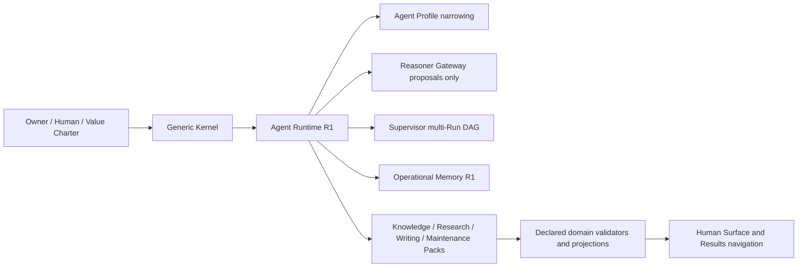

联邦连接是执行器互操作的 repository dependency，不是新增 L7 或现实因果边；
`agent_platform.federation` 的传播契约与 Knowledge/Writing/Pack 投影分离。

Kernel 不导入 Knowledge，Reasoner 不执行动作，Profile 只能收窄既有 scope，
Pack validator 只能作用于 manifest 声明范围，Operational Memory 不是知识真值
库，Supervisor 不能扩大 child permission。详细人话契约见
[Agent Platform R2](docs/architecture/agent-platform-r2.md)，机器边界见
`data/operations/project-components.json`、
`data/operations/change-propagation-topology.json`、Pack manifests 和
`data/architecture/agentization-boundary-r0.json`。

## 迁移与审定分层

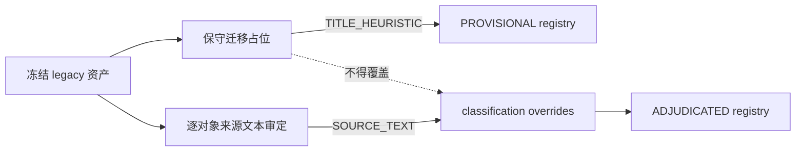

`migration_coverage=complete` 只说明 ID 与来源映射存在；`semantic_adjudication=incomplete` 说明仍有 D598 未深审。迁移器只能产生 `PROVISIONAL` 占位，已审定记录由独立 override 层保护。

## 七层关系

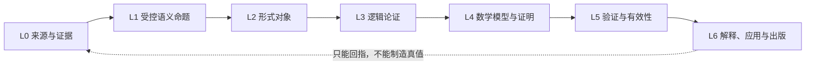

L0 记录来源事实；L1 声明主体、条件、量词、范围与失败边界；L2 选择正确对象类型；L3 显式保存前提、规则与结论；L4 保存模型、证明义务、证明和反例工件；L5 分开评估形式、逻辑、数学、经验、范围和来源；L6 负责阐释与发布。

## 横穿 L0—L6 的语言—思维逻辑平面

任务 114 将[语言—思维逻辑平面](docs/architecture/language-thought-logic-plane.md)收口为正交 control plane。语言从来源进入时就会影响行为者、体貌、证据来源、对象包装、连接关系和信息顺序，因此不能只在 L6 修文风；但语言形式不构成更高真值等级，所以也不增加 L7。

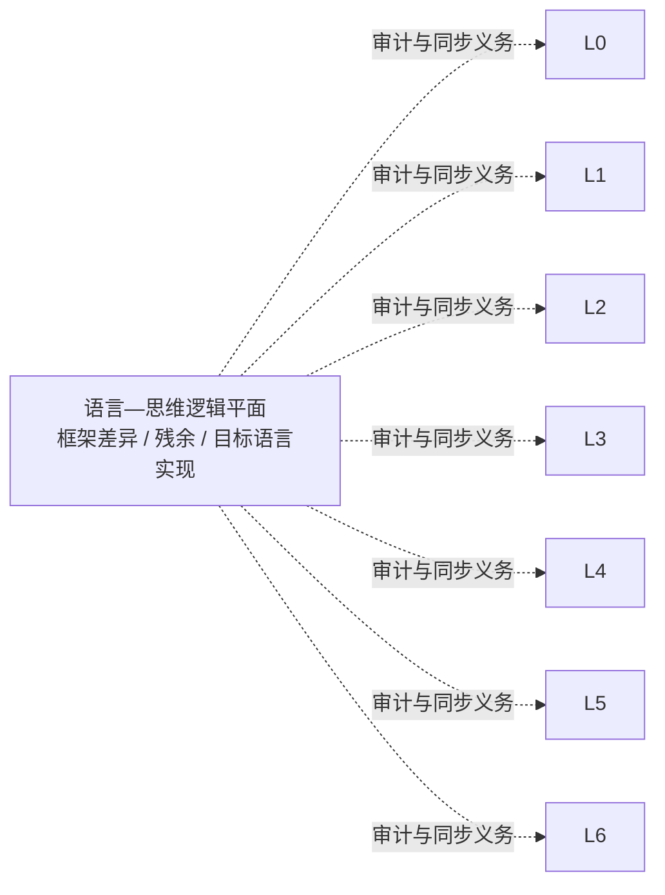

平面使用有限十二维基底和语言配置，不为每种语言复制一套算法。现代普通话书面中文与当代标准书面英语为完整配置；日语与土耳其语只作为有边界的对照试点，不能独立批准相应语言出版。结构化门要求来源、候选意义、目标形式、框架差异和未映射残余同时存在，并在认识相关变化静默时失败关闭；它不声称从任意散文中自动理解语言，自然度和文学标记性仍须人工审查。

## 点火与之元写作法的同源认知投影及 L6 双向反馈

任务 114 已将[之元写作法 0.5.0](docs/publication/zhiyuan-writing-method.md)收口为现有 L6 的当前公共表达与反馈能力；0.4.0 与 0.3.0 保留为历史已合并版本。0.5.0 继承双来源素材池，并作为语言—思维逻辑平面的一个目标语言使用者；平面属于点火整体，不埋在写作法内。它仍不增加 L7 或新真值层。其有边界关系表述仍是：`maintainer-declared shared cognitive provenance / structurally auditable homology candidate`；此处 `candidate` 指结构对应的认识论地位，不是方法生命周期。

点火与之元写作法被维护者声明为同一认知运动在不同任务约束下形成的投影：点火把材料、残余、跨尺度联系、语义修订、行动后回照、历史保存和停止条件约束成可审计的来源、模型、验证和迭代；之元写作法让相近运动在公共语言中被读者经历，并把作品暴露的误解、遗漏主体、失败同构、伪压缩和现实反例送回项目。

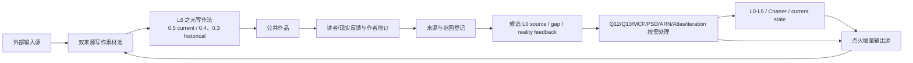

两条契约：

- 向外表达：`external inputs + provenance-bound ignition increments / Charter / current state → L6 Zhiyuan Writing Method → public work`。点火增量可继续成为写作材料，但必须保存生成路径、版本、claim ceiling、原始来源与残余，不能重算为独立复证。
- 返回点火：`public work / response / revision → provenance capture → candidate L0 source or gap → applicable project operation`。反馈先成为候选输入；点赞、赞美、传播、共鸣或多 AI 一致不是事实证据。

同源不等于同一：本关系不是脑科学发现、形式同构证明、因果识别或固定项目本体。之元写作法不能替代 Foundation、证明、validator、Function OS、MCF、PSD、ARN 或迭代纪律；点火也不能从个人文风自动推出。操作位置仍在 L6，生成来源跨越项目整体，但证据权限不高于 L6。

### L6 成果展示与来源链投影

121Q30T 已将成果展示收口为当前 L6 内部的可追溯接口，不增加架构层：人类索引负责完整导航，机器 registry 负责排序和路径绑定，正式作品负责公共表达，案例页负责来源与版权边界，分析报告负责 claim ceiling 与竞争解释。README 只投影 registry 最近三项，不成为第二份成果权威。

`case provenance → point-fire analysis → accepted work → method version`

该链只证明某个版本的来源、分析、方法与作品可被共同审计。作品被接受不证明来源命题为真、分析完成因果识别、方法普遍有效或 AI 复制了作者；受限原始材料只保留 provenance，不因成果展示而重新公开。

### 完整可点击系统图

Q32I 收口后的早期系统图与后续 registry-derived 系统图均保留为 Historical 投影；Current 版本和最近历史版本由 generated Current Snapshot 与 map layout 读取。节点身份、canonical target 与生命周期从 `data/operations/project-components.json` 派生；可见关系及其权限域从 `data/operations/change-propagation-topology.json` 派生；`data/architecture/interactive-system-map-layout.json` 只保留布局。生成器产生 materialized spec 与同一 interactive SVG，再由 README 与仓库 Markdown 投影。

该链由当前迭代操作法继承并保留声明关系下的变更传播闭包。`substantive_causal_candidate`、`repository_dependency` 与 `synchronization_obligation` 权限分离；只有后两者按声明规则触发自动或必要评估。Git diff、依赖、可达路径与视觉位置不构成现实因果识别。它覆盖现有 L0—L6、核心、模型、操作、规范、公共表达、Agent Platform、OS Control Plane、Durability / Lifecycle、External Agent Federation、Structural Governance Surface 与反馈环，不增加架构层；当前版本与计数以 generated Current Snapshot 和 Current Facts 为准；Structural Governance Surface 是 advisory overlay，不是现实因果或权限边。
当前投影的派生覆盖、map 版本和计数只用于仓库导航和同步校验，不构成完整性或现实事实证明。

## 目录权威

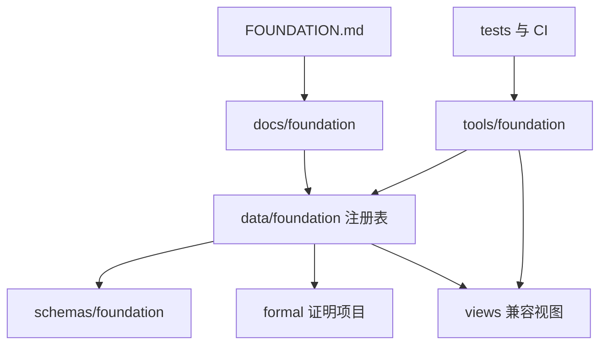

`data/foundation/` 是状态与映射的机器权威；旧函数表与旧案例表的来源证据、路径、Git blob 与转换记录由 `data/foundation/migrations/legacy-table-migration.jsonl` 承接；当前人类入口由 `docs/human/function-assets/` 与 `docs/human/nonfunction-assets/` 确定性派生。

## 数据流

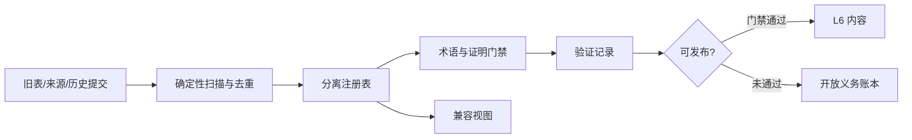

去重实体键为 `(asset_kind, normalized_namespace, normalized_id)`；表示层键为 `(entity_key, path, git_blob_sha)`。对象、命题、论证、来源、证据、映射、证明和验证不可混算。

## 状态流转

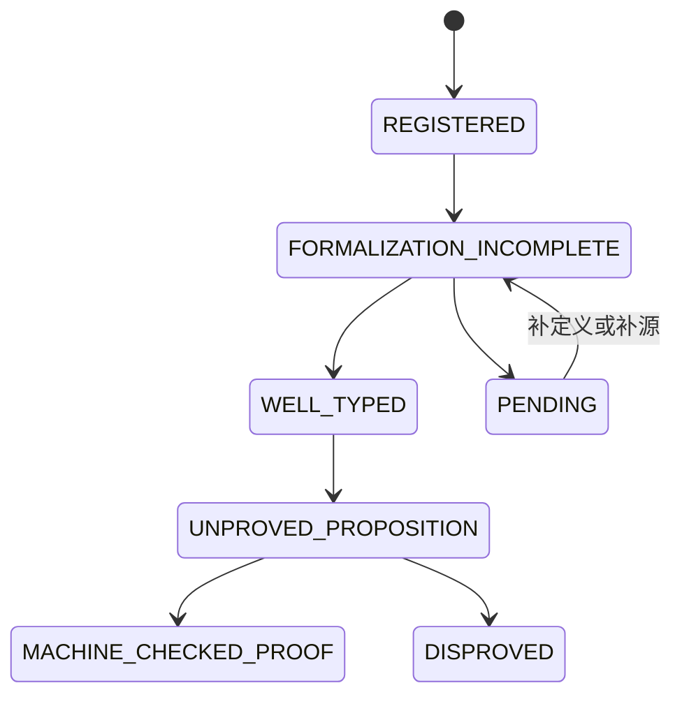

九个独立状态轴为 workflow、semantic、formal、logic、proof、evidence、scope、provenance、migration。任何一轴不得自动升级另一轴；工作流关闭不是真值，案例累积不是定理，机器证明也不自动产生经验真实性。K13 `ASSERTION_NON_ESCALATION` 进一步禁止工程、叙事、重复引用、跨域对应、模型美感或 Agent 共识自动抬升断言地位；长期风险是系统从自我克制滑向大断言。

## 迁移图

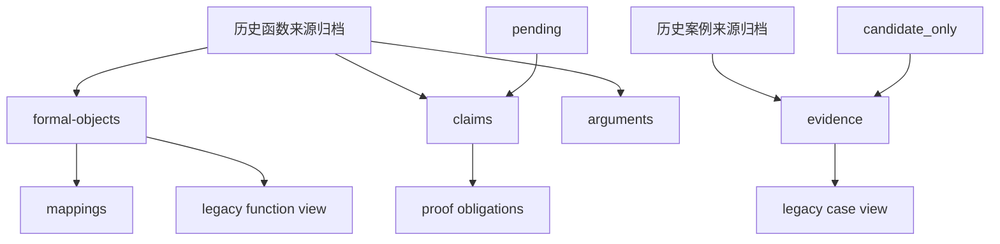

迁移是可逆、增量、非破坏性的。回滚只需移除生成的注册表和视图；旧资产不得重编号或覆盖。

## 核心系统定性

- Ψ0/Y1 是工作流编排器，不是凭乘积符号成立的证明函数。
- J+、J- 是内部正/负证据通道，不是真值或证明 oracle。
- 十二元协议是规范、启发式或治理算子，不自动成为公理。
- 64 组合是设计/生成空间，不是理论证明空间。
- G_delta 仅可作为有适用条件的外部定理引用或受限类比。
- C(x,y) 是机制假说，不是已识别因果；I_iso 是结构对应关系，不是严格同构。
- Ψ0 中的乘号表示流程组合或联合约束，不表示普通数值乘法。

执行入口与门禁见 [FOUNDATION.md](FOUNDATION.md)。

## 121Q12 双环操作 overlay

121Q12 在七层架构之上增加跨层操作 overlay，不新增真值层，不改变 L0—L6 的关系。

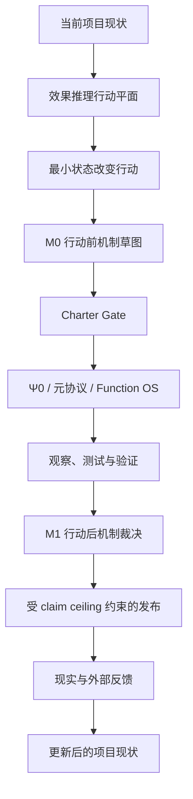

边界：

- 效果推理产生行动候选，不产生真值。
- 机制判断产生受约束的解释，不自动产生因果证明。
- Charter Gate 仍位于两平面之上，决定行动是否可做、可如何做。
- Ψ0 仍是 workflow orchestrator / algorithm protocol；本 overlay 不改写 Ψ0。
- Function OS 负责执行动作，不决定动作是否值得。
- C(x,y) 仍是机制假说，不因机制图存在而升级为已识别因果。
- L6 发布必须受 claim ceiling 约束，不能用解释性语言制造下层真实性。

操作入口：

- [docs/architecture/effectual-action-plane.md](docs/architecture/effectual-action-plane.md)
- [docs/architecture/mechanism-adjudication-plane.md](docs/architecture/mechanism-adjudication-plane.md)
- [docs/governance/non-sycophancy-output-protocol.md](docs/governance/non-sycophancy-output-protocol.md)

## 121Q13 注意力、分布与压缩控制 overlay

121Q13 继续作为跨层控制 overlay，不新增真值层，不升级理论地位。它约束三件事：

- 循环是否还有信息增量；
- 输出样本是否被误当作答案或事实证据；
- 新术语是否是真压缩，还是标签、伪组块或巨型吸引子。

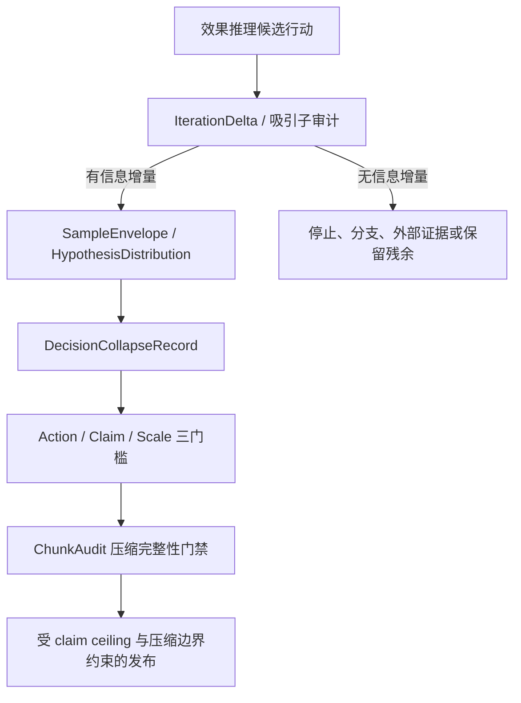

边界：

- AI 采样只能进入 hypothesis / interpretation / review 通道，不能直接升级为外部事实、数学证明或经验因果。
- 行动坍缩只说明选择了下一步，不说明假设分布已经收敛为真。
- 新术语通过 ChunkAudit 也不表示理论升级；它只表示该术语目前可展开、可生成问题、可减负且不会终止追问。

121Q13 入口：

- [docs/architecture/attention-attractor-control-plane.md](docs/architecture/attention-attractor-control-plane.md)
- [docs/architecture/distribution-collapse-control-plane.md](docs/architecture/distribution-collapse-control-plane.md)
- [docs/architecture/compression-integrity-gate.md](docs/architecture/compression-integrity-gate.md)

## 121Q14 点火地图集 overlay

121Q14 增加版本化地图投影与导航 overlay，不新增真值层，不废弃矩阵或 registry，也不建立永久唯一总地图。

地图只回答：从特定观察者、决策问题、价值接受者和 `as_of_commit` 出发，当前地形如何导航，哪些依赖、成本、演进阶段、资源决策和未映射残余需要显式记录。

边界：

- 地图坐标不是事实证明。
- 视觉邻近不是同构。
- 演进阶段不是自然定律。
- 依赖关系不是机制因果。
- 自建、采购、租赁或外包建议不能转移 Charter Gate 责任。

121Q14 入口：

- [docs/architecture/ignition-atlas.md](docs/architecture/ignition-atlas.md)
- [data/atlas/generated/ignition-atlas-121q14.json](data/atlas/generated/ignition-atlas-121q14.json)
- [reports/atlas/121Q14-dynamic-atlas.md](reports/atlas/121Q14-dynamic-atlas.md)
