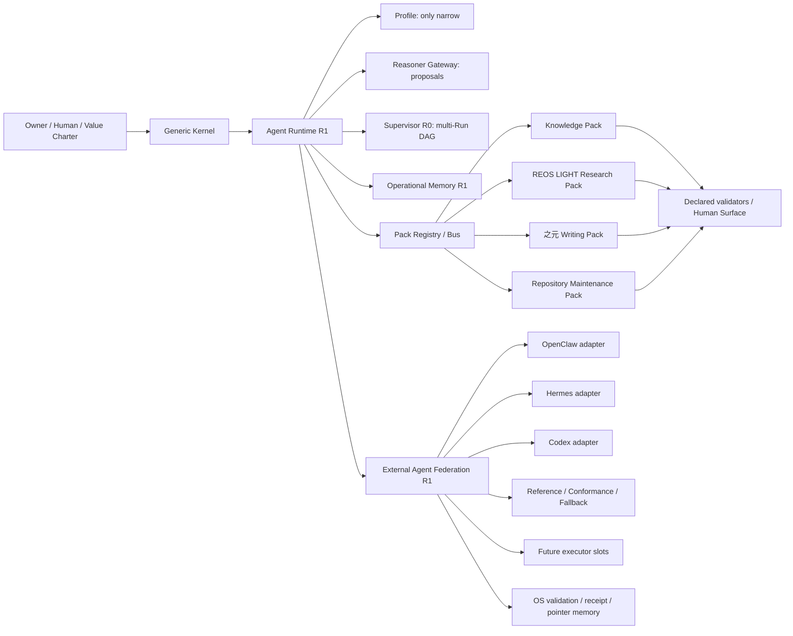

# Agent Platform R2 — 点火工程脊柱与边界

本页是 R2 的人类架构说明。它回答“这套工程接口怎样分工、为什么存在、怎样
找到机器证据、不能推出什么、还缺什么”；机器契约仍以 registry、schema、
manifest、测试和 receipt 为准。本页不新增 L7，不替代 Foundation、claim/evidence
registry、Value Charter、Results Book 或唯一完整系统图。

## 一句话身份

点火当前主干是一个有界、可审计、可恢复的 Agent Platform 原型；知识治理是
它的第一个大型 Domain Pack，而不是整个系统本体。当前公开上限仍为
`CURRENT_WITH_OPEN_OBLIGATIONS`，`EPISTEMICALLY_ACCEPTED=0`。

当前身份 contract/facts 见 [`current-system-identity.json`](../../data/architecture/current-system-identity.json)
和 [`current-facts.json`](../../data/architecture/current-facts.json)：点火是 OS /
orchestration-governance layer 与 driver，OpenClaw、Hermes、Codex 是外部可替换
executors，当前唯一完整系统图为 `0.8.0`（`0.7.0` Historical）。默认策略是
integrate public boundary；本地行动层只保留 Reference / Conformance / Fallback。

## 组件怎样分工



- **Kernel** 保存领域无关 identity、state、capability、approval、audit、
  checkpoint、handoff、resume lineage 和 non-escalation contract；不导入
  Knowledge、Research、Writing 或具体 provider。
- **Runtime** 执行 R1 的 bounded local action protocol，并负责声明式 Pack
  discovery/load、Profile 投影、Gateway 输入输出、Pack-aware routing、memory
  store 和 Supervisor 调度。
- **Profile** 可以交集化 capability、Pack、tool、budget 和 approval scope；
  只能收窄，不能扩张 Charter、WorkspacePolicy、executor 或 Owner authority。
- **Reasoner Gateway** 接受 versioned request，返回 digest-bound typed
  proposal；Reasoner 永远不是 Executor，model/provider 字段只是 telemetry。
- **Supervisor** 管理有依赖的 child Runs、全局 actions/time/output budget、
  approval aggregation、有限 retry、checkpoint/resume、executor-instance
  handoff 和明确 episode roll-up；不能扩大 child permission。
- **Operational Memory** 只保留带来源、保留/可见性/敏感度、supersession 和
  integrity 的运行摘要，支持 bounded capsule、forget/tombstone；它不是
  Knowledge truth registry，也不保存 secret、完整 prompt 或 hidden CoT。
- **External Agent Federation** 维护点火 OS 与可替换 executor 之间的统一
  contract、capability/permission/health 路由、approval intersection、
  handoff、failover、独立 validation、receipt 和 pointer-only memory。OpenClaw、
  Hermes、Codex 是 adapter family；现有本地行动层只冻结为 Reference /
  Conformance / Fallback，不再向万能 Agent 壳扩张。

## Domain Pack 定位

| Pack | 负责什么 | 明确不负责什么 |
| --- | --- | --- |
| Knowledge | Foundation、claims、formal/evidence/proof、M/E、Knowledge Experience、Results 与 epistemic correction 的声明式对象和 validator | Kernel lifecycle、generic permission、Owner acceptance、truth upgrade |
| REOS LIGHT Research | bounded research obligation coordination、evidence request 和研究流程验证 | `REOS_FULL`、distributed queue、truth/evidence authority、自动 `EPISTEMICALLY_ACCEPTED` |
| 之元 Writing | 0.5.0 的 L6 表达、source/provenance 绑定、publication surface 与人工编辑入口 | 事实证明、文学质量自动裁定、Claim/M/E/Owner 状态升级 |
| Repository Maintenance | 声明式仓库检查、offline maintenance proposal、checkpoint receipt 和本轮离线 pilot | network、remote Git mutation、delete、executor selection、permission 或 truth authority |

Pack manifest 可被发现、校验和 metadata-load；Pack Bus 只返回
`ROUTED_PROPOSAL`，validator/hook 只返回其 declared scope 内的 receipt/proposal。
未声明 capability、object type、entrypoint 或 authority 都 fail closed。

### 四条不可越权红线

- `Kernel ≠ Knowledge`：Kernel 不承载领域对象、知识真值或 Knowledge Experience。
- `Reasoner ≠ Executor`：Reasoner 只返回 digest-bound proposal，不能直接执行动作。
- `Pack ≠ truth authority`：Pack 的 validator、hook 和 receipt 不能升级 truth、Owner 或 epistemic authority。
- `pilot ≠ general intelligence`：离线 pilot 只说明这次仓库 fixture 的观察结果。
- `OS ≠ executor`：联邦 adapter 只翻译 public boundary；外部 session、vendor
  telemetry、prompt、token、secret、hidden reasoning 与 channel 状态不进入
  canonical memory、Knowledge 或 Human Surface。

## 当前已观察到什么

R2 的离线 pilot 在 disposable source repository 的 fresh clone 上运行
`audit → repair → validate` 多 Run DAG。它记录了 typed approval、一次
`post_execute_before_persist` checkpoint、不同 executor instance 的恢复、
`FAILURE`/`EPISODIC` operational memory，以及拒绝网络/远端 Git/自我批准的
adversarial episode。机器 receipt 位于
[`r2-offline-repository-maintenance`](../../data/agent-runtime/pilots/r2-offline-repository-maintenance/)，
人类简报位于同目录的 `HUMAN-REPORT.md`。

这只建立本仓库、这份 disposable fixture、这组 allowlist 和这次执行中的观察。
它不能建立生产可靠性、外部仓库安全、现实世界因果、普适安全、长期自主性、
通用智能、Owner acceptance 或外部有效性。

## 机器权威与使用入口

- [Agentization boundary projection](../../data/architecture/agentization-boundary-r0.json)（R0 historical boundary）
- [component registry](../../data/operations/project-components.json)
- [typed propagation topology](../../data/operations/change-propagation-topology.json)
- [R2 propagation contract](../../data/operations/propagation/agent-platform-r2-propagation-contract.json)
- [Agent Profile registry](../../data/agent-runtime/agent-profiles-r1.json)
- [Pack manifests](../../packs/)
- [R2 night-shift ledger](../../data/operations/iterations/121/nightshift-progress.jsonl)
- [unique complete system map](./interactive-system-map.md)

Local smoke commands remain provider-neutral and offline:

```bash
PYTHONPATH=. python3 -m unittest tests.test_agent_runtime_r0 tests.test_agent_runtime_r1
PYTHONPATH=. python3 tools/validate_pack_registry.py
PYTHONPATH=. python3 tools/validate_supervisor.py
PYTHONPATH=. python3 tools/validate_r2_offline_repository_maintenance.py
```

R2 does not authorize Telegram/OpenClaw/Hermes daemons, browser automation, live
provider/API secrets, vector databases, network actions, automatic Git push/merge,
persona or consciousness claims, or a second physical Pack migration.

## External Agent Federation R1

联邦的完整边界、适配器职责、Reference freeze、Future executor 插槽和维护者
冷启动入口见 [External Agent Federation R1](./external-agent-federation-r1.md)。
Step 09 的 bounded smoke receipt 只记录 fresh CLI probe、OpenClaw skip 和
Hermes/Codex timeout；没有可接受 live completion。Step 10 的 disposable Pilot
A/B/C 比较 protocol compatibility，不比较智能。传播契约把
`agent_federation/` 单独归入 `agent_platform.federation`，禁止它直接生成
Knowledge census、Fire Seeds、Writing publication、Human front-door 或 Pack
registry；这些表面仍由各自 canonical source 管理。
