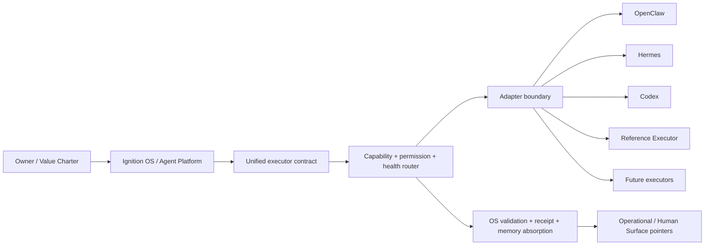

# External Agent Federation R1 — ownership boundary

点火是 OS，不是另一个 OpenClaw、Hermes 或 Codex。它维护目标、价值、
任务契约、权限、长期状态、Pack、记忆、验证、handoff、provenance 和结果
吸收；外部智能体是可替换执行器。适配器只翻译可观察边界，不复制外部
Agent 的运行时。

本页与 [`CURRENT_STATE_SYNC_INVARIANT`](../governance/current-state-sync-invariant.md)
的当前身份保持一致：点火是 driver / orchestration-governance layer，Knowledge
是第一个大型 Domain Pack，默认决策是 integrate 而不是重造。当前计数、地图版本
`0.16.0`（`0.14.0` Historical、`0.13.0` 及之前为更早 Historical）和 live ceiling 以 [`current-facts.json`](../../data/architecture/current-facts.json)
为准；真实 live invocation 仍可在安全边界无法满足时明确 `SKIPPED`。

Task 126 的 Structural Governance Surface 是 Federation 可选择读取的 advisory
cross-cutting overlay。它只暴露声明的 claim ceiling、unknowns、source pointers
和实验臂元数据；它不改变 capability、permission、authorization、truth、Owner
状态或 `EPISTEMICALLY_ACCEPTED`。完整边界见
[`soft-context-exposure-contract-r0.json`](../../data/agent-federation/soft-context-exposure-contract-r0.json)。

Task 127 的 Durability / Lifecycle R3 仍由 Ignition OS / driver 持有：Federation
只接收声明的 workspace、policy、capability 和 reconciliation 边界，不拥有 snapshot、
migration、namespace、Pack lifecycle、revocation、accounting、recovery 或 DR authority。
若 external dispatch 不确定，OS 只记录 `REQUIRES_RECONCILIATION`，禁止通过任何 adapter
自动重放；repository-local continuity pilot 不是 live executor success、production
durability、exact-once delivery、Owner acceptance 或 epistemic acceptance。

Task 129 的 Steering / Intent / Goal / Obligation R1 只向 Federation 发放经过边界收窄的
`IntentCapsule`：capsule 携带成功标准、权限上限、blocker、时间引用、report contract 和
最小 context 引用，不携带 canonical registry 写权限。外部 executor 的 report、telemetry
或 `PASS` 不能写回 canonical Intent，也不能推断 Goal completion；独立 Completion Contract
和 OS reconciliation 仍是必要条件。

Task 124 的 OS Control Plane R2 是 Federation 上游的有界交通系统：Event Ledger、
monotonic policy compiler、resource arbitration、bounded concurrent scheduler、
executor health lease、queue/backpressure、durable dispatch/reconciliation、
concurrent operational memory 和 Driver Console 先决定是否可 admission、路由、
回执或恢复；外部 adapter 不能跳过这些 OS 边界。离线 pilot 的 receipt 不是 live
provider completion，也不改变 `REFERENCE_EXECUTOR / CONFORMANCE_EXECUTOR /
FALLBACK_MINIMAL` 冻结。

## Architecture hierarchy

这是一条仓库工程职责链，不是新的 L7、能力等级或供应商比较。OS 保留
目标、policy、approval、workspace、handoff、独立 validation、receipt 和
operational-memory 投影；adapter 只保留 public boundary、sanitized output
和 pointer-only session。任何外部会话、隐藏思维、供应商 telemetry、prompt、
token、secret 或 channel 状态都不能成为点火的 canonical memory 或 Human
Surface 内容。

## 一句话

> 点火负责“为什么做、做到哪里、由谁做、怎样证明、怎样记住”；外部智能体负责“具体怎么动手”。

## Machine contract

- [OS / Executor ownership](../../data/agent-federation/os-executor-ownership-r1.json)
- [Build versus integrate policy](../../data/agent-federation/build-vs-integrate-policy-r1.json)
- [Executor component ownership](../../data/agent-federation/executor-component-ownership-r1.json)
- [Step 00 inventory](../../data/agent-federation/executor-inventory-r1.json)

## Provider-neutral executor admission

Task 142 adds an OS-owned admission layer between the Federation contract and
the Live External Executor Bridge. Admission is evaluated from the same
dimensions for every installed candidate: public installation/version
attestation, one-shot noninteractive interface, publicly confirmable auth
without new billing, read-only task-workspace binding, disposable runtime
scratch, strict structured-result support, timeout/cancel/cleanup behavior,
durable capture, independent validator compatibility and explicit
no-channel/no-browser/no-remote-write boundaries. Brand, model strength or
ranking is not an admission condition.

The admission record is a fail-closed eligibility projection, not a provider
implementation or a success claim. A candidate that passes this gate would
still return an executor receipt as `RETURNED_UNVALIDATED`; only the
independent exact-bound validator can produce a bounded
`LIVE_READONLY_VALIDATED_COMPLETION`. A reasoner runtime or ordinary tool is
never promoted to an `AGENTIC_EXECUTOR` by the gate, and a long-term open
obligation never keeps a formally completed task in `RUNNING`.

The ownership labels are `OS_OWNED`, `EXTERNAL_AGENT_OWNED`,
`ADAPTER_BOUNDARY`, `REFERENCE_ONLY` and `DEFERRED`. These are engineering
ownership labels, not truth or authority upgrades.

### OpenClaw adapter boundary

OpenClaw 适配器只调用可观察的 public CLI boundary，输入为临时 UTF-8 envelope，
输出为经过 redaction 的 public response 与 pointer-only session。它不接管
Gateway、channel、私有数据库、daemon、长期会话或配置/secret；未声明的
progress、cancel、resume 和外部 effect 一律 fail closed。当前 R1 只记录
本地 help/version observation；Step 09 的 fresh probe 与 bounded smoke receipt
另行记录，不能推出 live provider 或生产可用性。

### Hermes adapter boundary

Hermes 以受限 text bridge 接入：只接受声明的低风险 `repo.read` envelope，
文本解析失败、输出过大、超时、缺 receipt 或越过 permission intersection
都进入失败/对账状态。适配器不带入 provider、用户配置、memory、hooks、
terminal、browser、message 或 device authority；文本可观察性也不等于
推理质量或外部有效性。

### Codex adapter boundary

Codex 适配器使用 public JSONL CLI boundary，默认 `read-only`、`ephemeral`、
isolated config/rules 和可选绝对 workspace。只保存事件计数、sanitized
summary、pointer-only thread 与 OS receipt；危险 bypass、隐藏 reasoning、
完整 prompt/token 和未验证 completion 不会跨过 OS contract。workspace-write
必须有显式 approval 与独立验证，不能由 executor 自行扩大。

## Reference Executor freeze

The existing `agent_runtime` local action plane remains available as
`REFERENCE_EXECUTOR / CONFORMANCE_EXECUTOR / FALLBACK_MINIMAL`. It may verify
the protocol, support deterministic conformance fixtures, provide a minimal
offline fallback and receive safe fault injection. It does not gain a browser,
network, messaging, provider/model, daemon, general subagent or remote Git
runtime in this task.

### Future executors

未来执行器只能作为 contract-compatible slot 被纳入：必须声明 capability、
permission、health、budget、granularity、privacy、workspace 和 handoff，接受
OS/external approval 的严格交集，产生可验证 receipt，并通过 conformance、
adversarial 和 fresh-clone replay。新 executor 不能因为品牌、模型能力或
“自己实现更快”而获得 truth、Owner、Knowledge、Pack 或 remote mutation
authority；不满足条件就保持 `DEFERRED` 或 `REQUIRES_RECONCILIATION`。

## Build versus integrate

The default decision is to integrate a public machine-facing interface from an
existing executor. A new executor shell is proposed only after a concrete,
reproducible failure crosses a declared permission, checkpoint, provenance,
provider-neutrality, validation, fail-closed, privacy, performance,
maintenance or architectural threshold. “We can write it ourselves” and “we
do not want to write an adapter” are not exceptions.

The validator is intentionally fail closed for new paths that look like
browser/gateway/channel/model-provider/subagent/daemon/remote-Git layers unless
the policy contains a complete `build_vs_integrate_exception` record.

The Reference Executor freeze is machine-checked in CI. Its product paths and
test-support paths are explicit, vendor capability upgrades must land in
adapter mapping, and adapters are statically rejected if they grow a runtime
loop. The CI gate also runs negative fixtures for browser, daemon, remote Git,
test-helper promotion and kernel-contract bypass; each must remain `FAIL`.

## Step 09 bounded real smoke

Step 09 re-probed the installed public CLI surfaces without trusting the Task 122
snapshot: OpenClaw `2026.7.1-2`, Hermes `v0.20.0 (2026.8.3)` and Codex
`0.144.4`. The machine receipt is
[`external-conformance-smoke-r1.json`](../../data/operations/iterations/123/external-conformance-smoke-r1.json).

OpenClaw was not dispatched because its observed agent surface has no disposable
workspace binding and the default Gateway could touch external session/channel
state. Hermes and Codex each received one short read-only task attempt from a
disposable local workspace; both hit the hard timeout and are recorded as
`SKIPPED_UNSAFE_OR_UNAVAILABLE` with `TIMEOUT`, not as live success. The
independent OS fixture validator passed, but no vendor completion was promoted
to an OS terminal state; prompts, tokens, credentials, provider telemetry and
private session state were not retained.

## Live External Executor Bridge R1

Task 136 adds the OS-owned live bridge that turns the Federation contract into a
bounded, provider-neutral dispatch boundary. The bridge owns the
LiveDispatchEnvelope, LiveCapabilityLease, literal-process transport,
strict LiveExecutorReceipt, independent fixture validation, timeout/cancel
handling and conservative reconciliation. It does not own an executor's
provider, channel, browser, remote Git, configuration, billing or completion
authority.

The live pilot remained synthetic, disposable and read-only: no message/channel,
browser, remote Git, executor configuration or new billing was permitted. Step
11 admitted Codex and Hermes to the preflight inventory, while OpenClaw was
skipped because the installed Gateway/agent surface could not prove all three
required boundaries: disposable workspace binding, an explicit read-only
permission ceiling and channel-off operation. Step 13 made one bounded Hermes
attempt; the process timed out with TIMED_OUT_EFFECT_UNKNOWN, cancellation
and reconciliation remained open, and the fixture was unchanged. No retry or
private-session propagation occurred.

Therefore the current bridge claim is exactly
LIVE_BRIDGE_IMPLEMENTED / LIVE_COMPLETION_NOT_OBSERVED; the
LIVE_EXTERNAL_INVOCATION obligation remains open. An executor-reported PASS,
if ever returned, would still enter RETURNED_UNVALIDATED until the
independent OS validator accepts it.

## Live Observation / Reconciliation Plane R1

Task 140 registers the bounded Observation / Reconciliation Plane as an
OS-owned architecture capability. Its canonical chain is
`Executor -> process transport -> durable capture/capsule -> append-only
LiveAttemptLedger -> deterministic Current observation projection ->
reconciliation and Pointfire independent validation -> Steering/Goal boundary`.

The plane keeps public probes, transport wrappers, live-process lifecycle,
durable capture, structured results, validator status and reconciliation state
typed and separately observable. A provider report is not an observation;
observation is not a validated outcome; a validated local outcome is not Goal
completion; reconciliation closure is not success or no-effect; and a Current
projection is not Owner authority. `TERMINAL_UNRECOVERABLE_*` states preserve
unknown effect or incomplete observation while allowing retry-safety workflow
to move forward. This R1 is a bounded repository-local observation and
reconciliation plane, not a world-truth sensing layer.

## Live State Semantics & Structured Result Reliability R1

Task 141 makes the observation dimensions explicit and keeps them provider-
neutral: dispatch crossing is not process start; process start is not an
independent inference marker; an inference marker is not a structured result;
and a structured result remains `RETURNED_UNVALIDATED` until exact task,
attempt, executor, adapter, lease, workspace, capture and validator binding
passes. The canonical R3 projection therefore records Task140 as process
observed while inference is `NOT_OBSERVED`, validated completion is
`NOT_VALIDATED`, and reconciliation is not blocked. It cannot emit the old
`LIVE_EXTERNAL_INVOCATION_NOT_OBSERVED` ceiling when a canonical attempt has
`live_process_started=true`.

FailureForensicsCapsule is an OS-owned sanitized boundary for malformed,
startup, parse, schema, transport and observation failures. It records public
argv/interface fingerprints, lifecycle and stream digests, parser/schema
status, stable diagnostic class, redaction, runtime scratch/auth/workspace
boundaries, inference status and raw-spool disposal status without storing raw
private output, secrets, hidden reasoning or provider-private telemetry.
Task140's malformed-result root cause remains
`ROOT_CAUSE_NARROWED_NOT_CONFIRMED`; a Codex same-family retry is therefore a
blind retry and remains forbidden until a concrete public root cause is fixed.

## Task 137 reconciliation continuation

Task 137 is a reconciliation continuation, not a new executor or topology
component. The historical Hermes timeout receipt has no bindable attempt
PID/PGID or durable disposable-workspace identity; equal fixture digests
therefore do not prove that an unknown external effect is absent. Its
reconciliation remains `OPEN`, and no blind retry is authorized. OpenClaw was
not invoked because its workspace/channel boundary remains unsafe.

The current Codex CLI received one fresh synthetic/read-only dispatch under a
new bounded lease. The child boundary was at most one level, used only the
synthetic fixture, forwarded no formal task context or private prompt, and
had no channel, browser, remote-Git, write or new-billing authority. Codex
failed closed during helper startup, returned no structured public result, and
left the fixture workspace unchanged. Pointfire recorded `MALFORMED_RESULT` /
`FAILED_VALIDATION`; independent OS validation did not run, so
`LIVE_EXTERNAL_INVOCATION` remains open and this observation is not
`COMPLETED_VALIDATED`, Goal completion or external truth.

## Task 138 runtime scratch separation continuation

Task 138 keeps the existing bridge and topology unchanged while separating
three filesystem domains: the synthetic task workspace remains disposable and
read-only; Codex helper/cache/app-server paths use an attempt-specific writable
runtime scratch; and existing auth/config state is referenced read-only without
secret materialization or config/billing mutation. The first repaired Codex
dispatch still failed before a structured result, with process-group cleanup,
unchanged workspace digest and no independent validation. A second real
invocation was not authorized: the public CLI did not expose a compliant
read-only auth-source route that could be used without exposing the real
auth/config write domain. The live completion obligation therefore remains
open and the claim ceiling is unchanged.

## Disposable pilot boundary

Step 10 的 Pilot A/B/C 只使用 disposable local fixture 和捕获的 public CLI
边界：Reference、OpenClaw、Hermes、Codex 的对照比较的是 protocol
compatibility，不是 intelligence。live external inference、login、daemon、
message、browser、network、background session 均保持
`NOT_RUN_LIVE_EXTERNAL_INVOCATION`。失败注入覆盖 timeout、malformed output、
stale receipt、forged approval/completion、duplicate dispatch、unknown side
effect 和 incapable handoff；它们只证明本仓库边界能够拒绝这些输入。

## Maintenance and cold start

维护者先读本页、`data/agent-federation/` inventory/ownership/contract、
`agent_federation/contracts.py` 与 `agent_federation/router.py`，再读对应
adapter 和 conformance tests。变更 `agent_federation/` 只进入
`agent_platform.federation` projection；Propagation contract 明确禁止它
直接生成 Knowledge census、Knowledge Experience、Fire Seeds、Writing
publication、Human front-door 或 Pack registry。若要改变这些表面，必须由
各自 canonical source 独立声明并验证。

## Boundary ceiling

This page describes repository engineering ownership. It does not establish
production autonomy, universal safety, external validity, Owner acceptance,
claim maturity or `EPISTEMICALLY_ACCEPTED`; the current state remains
`CURRENT_WITH_OPEN_OBLIGATIONS`.
