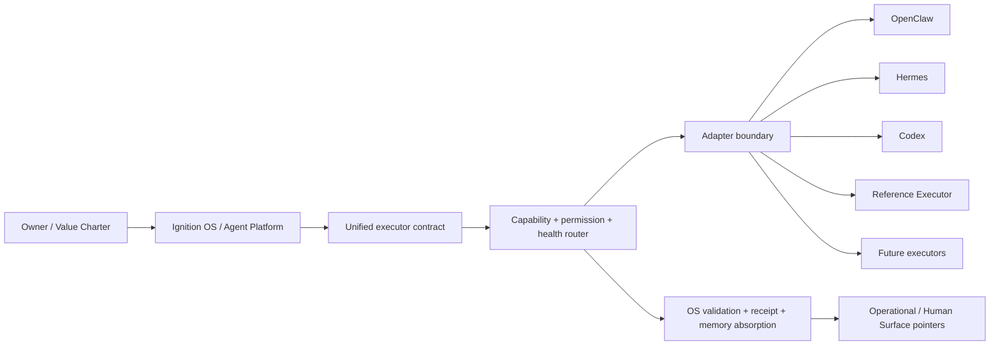

# External Agent Federation R1 — ownership boundary

点火是 OS，不是另一个 OpenClaw、Hermes 或 Codex。它维护目标、价值、
任务契约、权限、长期状态、Pack、记忆、验证、handoff、provenance 和结果
吸收；外部智能体是可替换执行器。适配器只翻译可观察边界，不复制外部
Agent 的运行时。

本页与 [`CURRENT_STATE_SYNC_INVARIANT`](../governance/current-state-sync-invariant.md)
的当前身份保持一致：点火是 driver / orchestration-governance layer，Knowledge
是第一个大型 Domain Pack，默认决策是 integrate 而不是重造。当前计数、地图版本
`0.8.0`（`0.7.0` Historical）和 live ceiling 以 [`current-facts.json`](../../data/architecture/current-facts.json)
为准；真实 live invocation 仍可在安全边界无法满足时明确 `SKIPPED`。

## Architecture hierarchy

这是一条仓库工程职责链，不是新的 L7、能力等级或供应商比较。OS 保留
目标、policy、approval、workspace、handoff、独立 validation、receipt 和
operational-memory 投影；adapter 只保留 public boundary、sanitized output
和 pointer-only session。任何外部会话、隐藏思维、供应商 telemetry、prompt、
token、secret 或 channel 状态都不能成为点火的 canonical memory 或 Human
Surface 内容。

## 一句话

> 点火负责“为什么做、做到哪里、由谁做、怎样证明、怎样记住”；外部智能体负责“具体怎么动手”。

## Machine contract

- [OS / Executor ownership](../../data/agent-federation/os-executor-ownership-r1.json)
- [Build versus integrate policy](../../data/agent-federation/build-vs-integrate-policy-r1.json)
- [Executor component ownership](../../data/agent-federation/executor-component-ownership-r1.json)
- [Step 00 inventory](../../data/agent-federation/executor-inventory-r1.json)

The ownership labels are `OS_OWNED`, `EXTERNAL_AGENT_OWNED`,
`ADAPTER_BOUNDARY`, `REFERENCE_ONLY` and `DEFERRED`. These are engineering
ownership labels, not truth or authority upgrades.

### OpenClaw adapter boundary

OpenClaw 适配器只调用可观察的 public CLI boundary，输入为临时 UTF-8 envelope，
输出为经过 redaction 的 public response 与 pointer-only session。它不接管
Gateway、channel、私有数据库、daemon、长期会话或配置/secret；未声明的
progress、cancel、resume 和外部 effect 一律 fail closed。当前 R1 只记录
本地 help/version observation；Step 09 的 fresh probe 与 bounded smoke receipt
另行记录，不能推出 live provider 或生产可用性。

### Hermes adapter boundary

Hermes 以受限 text bridge 接入：只接受声明的低风险 `repo.read` envelope，
文本解析失败、输出过大、超时、缺 receipt 或越过 permission intersection
都进入失败/对账状态。适配器不带入 provider、用户配置、memory、hooks、
terminal、browser、message 或 device authority；文本可观察性也不等于
推理质量或外部有效性。

### Codex adapter boundary

Codex 适配器使用 public JSONL CLI boundary，默认 `read-only`、`ephemeral`、
isolated config/rules 和可选绝对 workspace。只保存事件计数、sanitized
summary、pointer-only thread 与 OS receipt；危险 bypass、隐藏 reasoning、
完整 prompt/token 和未验证 completion 不会跨过 OS contract。workspace-write
必须有显式 approval 与独立验证，不能由 executor 自行扩大。

## Reference Executor freeze

The existing `agent_runtime` local action plane remains available as
`REFERENCE_EXECUTOR / CONFORMANCE_EXECUTOR / FALLBACK_MINIMAL`. It may verify
the protocol, support deterministic conformance fixtures, provide a minimal
offline fallback and receive safe fault injection. It does not gain a browser,
network, messaging, provider/model, daemon, general subagent or remote Git
runtime in this task.

### Future executors

未来执行器只能作为 contract-compatible slot 被纳入：必须声明 capability、
permission、health、budget、granularity、privacy、workspace 和 handoff，接受
OS/external approval 的严格交集，产生可验证 receipt，并通过 conformance、
adversarial 和 fresh-clone replay。新 executor 不能因为品牌、模型能力或
“自己实现更快”而获得 truth、Owner、Knowledge、Pack 或 remote mutation
authority；不满足条件就保持 `DEFERRED` 或 `REQUIRES_RECONCILIATION`。

## Build versus integrate

The default decision is to integrate a public machine-facing interface from an
existing executor. A new executor shell is proposed only after a concrete,
reproducible failure crosses a declared permission, checkpoint, provenance,
provider-neutrality, validation, fail-closed, privacy, performance,
maintenance or architectural threshold. “We can write it ourselves” and “we
do not want to write an adapter” are not exceptions.

The validator is intentionally fail closed for new paths that look like
browser/gateway/channel/model-provider/subagent/daemon/remote-Git layers unless
the policy contains a complete `build_vs_integrate_exception` record.

The Reference Executor freeze is machine-checked in CI. Its product paths and
test-support paths are explicit, vendor capability upgrades must land in
adapter mapping, and adapters are statically rejected if they grow a runtime
loop. The CI gate also runs negative fixtures for browser, daemon, remote Git,
test-helper promotion and kernel-contract bypass; each must remain `FAIL`.

## Step 09 bounded real smoke

Step 09 re-probed the installed public CLI surfaces without trusting the Task 122
snapshot: OpenClaw `2026.7.1-2`, Hermes `v0.20.0 (2026.8.3)` and Codex
`0.144.4`. The machine receipt is
[`external-conformance-smoke-r1.json`](../../data/operations/iterations/123/external-conformance-smoke-r1.json).

OpenClaw was not dispatched because its observed agent surface has no disposable
workspace binding and the default Gateway could touch external session/channel
state. Hermes and Codex each received one short read-only task attempt from a
disposable local workspace; both hit the hard timeout and are recorded as
`SKIPPED_UNSAFE_OR_UNAVAILABLE` with `TIMEOUT`, not as live success. The
independent OS fixture validator passed, but no vendor completion was promoted
to an OS terminal state; prompts, tokens, credentials, provider telemetry and
private session state were not retained.

## Disposable pilot boundary

Step 10 的 Pilot A/B/C 只使用 disposable local fixture 和捕获的 public CLI
边界：Reference、OpenClaw、Hermes、Codex 的对照比较的是 protocol
compatibility，不是 intelligence。live external inference、login、daemon、
message、browser、network、background session 均保持
`NOT_RUN_LIVE_EXTERNAL_INVOCATION`。失败注入覆盖 timeout、malformed output、
stale receipt、forged approval/completion、duplicate dispatch、unknown side
effect 和 incapable handoff；它们只证明本仓库边界能够拒绝这些输入。

## Maintenance and cold start

维护者先读本页、`data/agent-federation/` inventory/ownership/contract、
`agent_federation/contracts.py` 与 `agent_federation/router.py`，再读对应
adapter 和 conformance tests。变更 `agent_federation/` 只进入
`agent_platform.federation` projection；Propagation contract 明确禁止它
直接生成 Knowledge census、Knowledge Experience、Fire Seeds、Writing
publication、Human front-door 或 Pack registry。若要改变这些表面，必须由
各自 canonical source 独立声明并验证。

## Boundary ceiling

This page describes repository engineering ownership. It does not establish
production autonomy, universal safety, external validity, Owner acceptance,
claim maturity or `EPISTEMICALLY_ACCEPTED`; the current state remains
`CURRENT_WITH_OPEN_OBLIGATIONS`.
