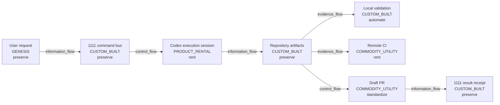

# map-agent-delivery-operations

Observer: maintainer coordinating AI execution, validation, PR review, and command-bus receipt

Decision question: Which delivery steps should remain human/accountable, which can be automated, and which are rented infrastructure?

Value recipient / affected subject: user, maintainer, reviewers, and future agents

Claim ceiling: `derived_operations_navigation_view`

## Map

## Unmapped Residue

- residue-human-review-quality: Actual quality and independence of future human/GPT review. (Requires later review behavior, not current repository topology.)
