# map-epistemic-architecture

Observer: maintainer and reviewer deciding how claims can move toward publication

Decision question: Which architecture surfaces constrain evidence, execution, validation, and publication?

Value recipient / affected subject: readers, maintainers, and subjects affected by claims

Claim ceiling: `derived_navigation_view`

## Map

```mermaid
flowchart LR
  charter_gate["Charter Gate<br/>CUSTOM_BUILT<br/>preserve"]
  l0_sources["L0 Sources and Evidence<br/>CUSTOM_BUILT<br/>preserve"]
  l1_claims["L1 Controlled Claims<br/>CUSTOM_BUILT<br/>automate"]
  l2_objects["L2 Formal Objects<br/>CUSTOM_BUILT<br/>automate"]
  l3_arguments["L3 Logical Arguments<br/>CUSTOM_BUILT<br/>preserve"]
  l4_proofs["L4 Proofs and Models<br/>PRODUCT_RENTAL<br/>rent"]
  l5_validation["L5 Validation<br/>CUSTOM_BUILT<br/>automate"]
  l6_publication["L6 Publication<br/>CUSTOM_BUILT<br/>preserve"]
  function_os["Function OS<br/>CUSTOM_BUILT<br/>automate"]
  q12_dual_loop["Q12 Dual Loop<br/>GENESIS<br/>preserve"]
  q13_controls["Q13 Attention/Distribution/Compression Controls<br/>GENESIS<br/>preserve"]
  charter_gate -->|control_flow| l0_sources
  l0_sources -->|evidence_flow| l1_claims
  l1_claims -->|information_flow| l2_objects
  l2_objects -->|dependency| l3_arguments
  l3_arguments -->|dependency| l4_proofs
  l4_proofs -->|evidence_flow| l5_validation
  l5_validation -->|control_flow| l6_publication
  function_os -->|evidence_flow| l5_validation
  q12_dual_loop -->|control_flow| function_os
  q13_controls -->|control_flow| q12_dual_loop
```

## Unmapped Residue

- residue-architecture-real-world-effect: Whether Q12/Q13 controls improve future reasoning behavior. (Requires later use and external feedback.)
