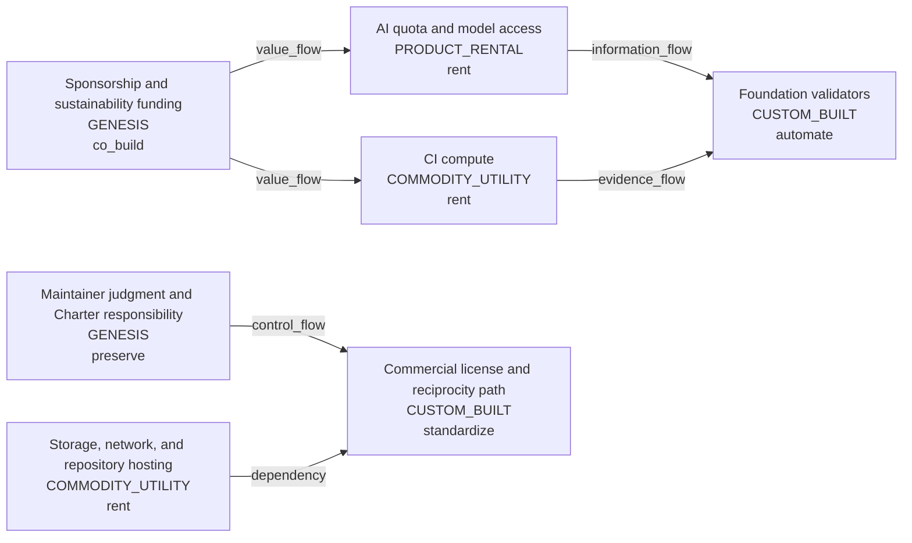

# map-maintainer-sustainability-economics

Observer: maintainer deciding what to keep, rent, automate, standardize, or fund

Decision question: Which costs and responsibilities must be retained, automated, rented, standardized, or covered by sponsorship?

Value recipient / affected subject: maintainer, noncommercial users, commercial users, and affected subjects

Claim ceiling: `derived_resource_navigation_view`

## Map

## Unmapped Residue

- residue-real-funding-response: Actual willingness of sponsors or commercial users to cover costs. (Requires real-world response beyond repository artifacts.)
